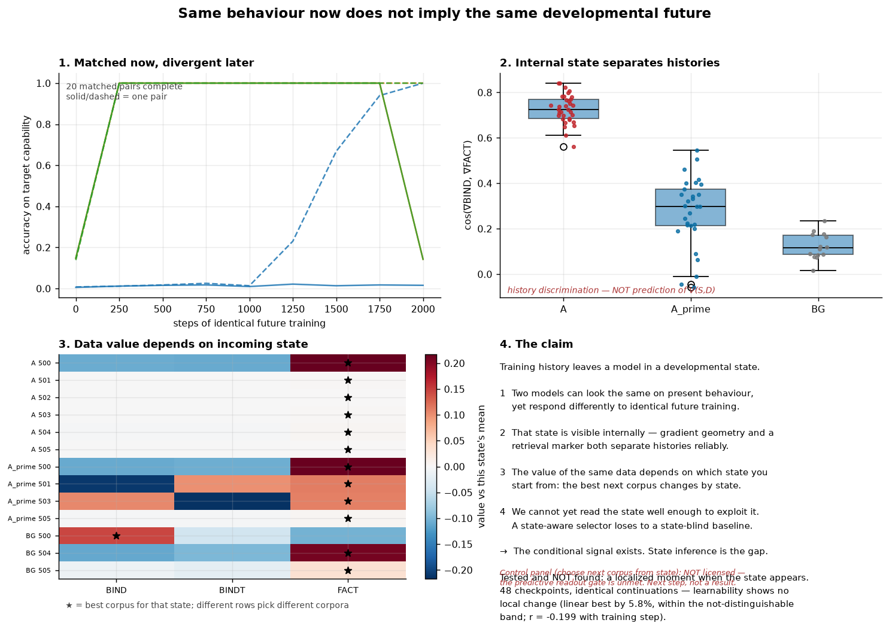

# Developmental System Identification for Pretraining

## What is the question?

Does what a model has already been trained on change **what it is able to learn
next** — and if so, can that be measured well enough to act on?

Not "does curriculum order matter". The sharper question is whether training
history leaves a model in a *developmental state* that determines the value of
subsequent data, and whether that state can be read from the model itself.

## What did we find?




**Training history produces a large, selective difference in future
learnability.** In a controlled language micro-world under ordinary next-token
prediction, a model trained on source `A` reaches **0.1322 ± 0.0149** zero-shot
accuracy on target capability `B`, while both controls sit at
**0.0156** — exactly the chance floor. Confirmatory, fresh seeds, frozen
criteria.

**It is selective.** A negative-control capability `C` shows no advantage
(+0.0395 against +0.5265 on `B`), and `C` is genuinely learnable, so the test
is not vacuous.

**It is not memorised content.** With **zero shared entity tokens** between
source and target, the effect is fully retained (111%).

The two controls play different roles. `A′` is the **matched control**: it
differs from `A` in exactly one property — whether a recurring entity keeps its
value — and is matched on unigram, bigram and positional statistics, entity
recurrence and distinct entities per document, all verified against a
same-stream null. `BG` is a plain background stream with no informative
structure, serving as a floor rather than a matched comparison.

**It survives 32× scale** (786k → 25.2M non-embedding parameters), exploratory.

**The value of data is conditional on model state.** We measured `V(S,D)` — the
value of training on corpus `D` starting from incoming model state `S` — across
a 48-cell grid of states and corpora. It shows a substantial State × Data
interaction (share 0.381–0.464) with genuine **ranking reversals**: the identity
of the best next corpus depends on the state you start from.

## What failed?

Kept visible, because the failures are informative and several are load-bearing.

| | |
|---|---|
| **Static curricula** | Block-sequential training destroys capability at equal compute: 0.383 mean / 0.106 min against interleaved 0.987 / 0.951 |
| **Composition** | With retention repaired, pairwise transfer does **not** compose into useful orderings (effect/noise −0.15) |
| **The pre-registered mechanism** | An off-distribution induction-style probe failed its confirmatory gate (selectivity 0.76 against ≥2.0). A striking single-seed transient did not reproduce anywhere |
| **Adaptive selection** | A state-aware selector **loses to a state-blind global-best rule** on held-out states (regret 0.047 vs 0.021). It beats random, so it learned the data main effect, not the conditionality |

Two further results — the causal mediation test recorded as *inconclusive
rather than negative*, and an earlier substrate that could not host a
behavior-matched test — are in [RESULTS.md](RESULTS.md).

## Why does it matter?

A strong State × Data interaction **together with** a failed predictor
localizes the bottleneck precisely. Neither alone would: an interaction without
a prediction attempt would leave the gap unmeasured, and a failed predictor
without a demonstrated interaction would just mean there was nothing to
predict.

> **The conditional training signal exists. State inference is inadequate.**

Data value genuinely depends on model state — that is measured, not assumed.
What is missing is a representation of state good enough to predict *which*
data is best. That is a specific, attackable technical bottleneck, and a better
place to stand than either "curriculum matters" or a premature claim of
adaptive pretraining.

## What remains unresolved?

* **Is the state causal?** Requires an intervention that first demonstrates it
  can move the capability. Top-k head ablation demonstrably cannot.
* **Can behaviorally matched models have different futures?** Prospective test
  with pairs frozen from present observables, pending.
* **When does the relevant state emerge?** Not detectably localized. A dense
  prospective replay — 48 checkpoints across source steps 150–450, each given an
  identical future continuation — found **no localized change in future
  learnability**: a linear description wins on held-out fit by only 5.8%
  (pre-declared as not distinguishable), and learnability correlates with
  training step at r = −0.199. An earlier changepoint result described only
  *acquired competence*, and at the 250-step sampling resolution available all
  that can be said is that competence rises somewhere within the first 250
  steps.
* **How far does the effect generalize?** The developmental radius — targets
  ordered by distance from the source — is not yet mapped.
* **Can state be read well enough to predict conditional data value?** The open
  problem. Current evidence argues against a small set of attention heads and
  toward gradient/update geometry.

## How do I reproduce it?

```bash
uv venv && uv pip install -e ".[dev]"

PYTHONPATH=src python scripts/preflight_microworld.py       # substrate checks
PYTHONPATH=src python scripts/audit_microworld_shortcuts.py # A/A' shortcut audit
PYTHONPATH=src python -m pytest tests/ -q                   # unit tests
PYTHONPATH=src python scripts/audit_claims.py               # recompute every headline number
```

**What reproduces from scratch.** The four commands above need no cached data:
the micro-world is generated deterministically from seeds, so the substrate
audits, the unit tests and the frozen-criteria checks all run on a clean clone.
Re-running the experiments themselves (roughly 200 training runs) reproduces
the headline numbers and takes a few GPU-hours.

**What does not.** `artifacts/` is gitignored and holds the run outputs those
numbers were computed from. `scripts/audit_claims.py` recomputes a set of
headline quantities from those units and prints them for comparison against the
ledger; it is a drift check a reader runs and reads, not an automated
verification of every number. Without the artifacts, the numbers must be
regenerated by re-running. No public artifact snapshot is published yet.

Protocols and selection artifacts are hashed and version-controlled. For the
prospective experiments, the analysis and selection decisions were frozen
before the corresponding outcomes were evaluated:

| frozen object | sha256 (first 16) |
|---|---|
| V2.1 spec | `f92f5831bece0d91` |
| what-next tournament protocol (unrun, trigger failed) | `f9da9fe23b1b2400` |
| downstream protocols | `8fc78c4087e2f87b` |
| latent-state protocol | `afd0bf5174cd8073` |

## Repository layout

Suggested reading order: **README** (what happened and why it matters) →
**[RESULTS.md](RESULTS.md)** (the evidence) → **[RESEARCH.md](RESEARCH.md)**
(where it goes next).

| path | contents |
|---|---|
| [RESEARCH.md](RESEARCH.md) | the scientific programme, evidence ladder, standing commitments, deferred work with triggers |
| [RESULTS.md](RESULTS.md) | claim ledger, chronology, barrier log — the canonical record |
| `docs/experiments/` | per-experiment designs and frozen protocols |
| `docs/technical.md`, `docs/risks.md` | system specification and risk register |
| `docs/archive/` | superseded plans and the original ordering programme, preserved verbatim |
| `src/dsi/`, `scripts/`, `tests/` | implementation |

## License

- **Code** (`src/`, `scripts/`, tests): [Apache License 2.0](LICENSE)
- **Written content and figures** (`report.md`, `README.md`, `RESEARCH.md`,
  `RESULTS.md`, `docs/`, `figures/`): [CC BY 4.0](LICENSE-CC-BY-4.0.md)
