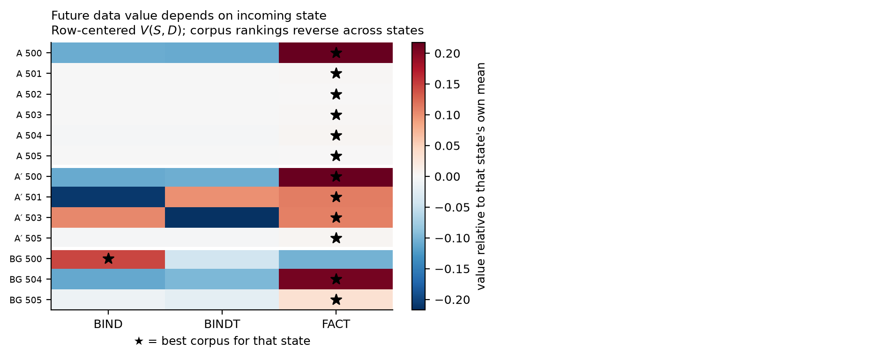

# Training History Shapes Development

**Patrick Walmsley**

## Abstract

Prior training changes what a model is ready to learn next. In a controlled
language-model environment, a source curriculum produces a large, selective
advantage in acquiring a later capability, while matched controls remain near
chance. The effect survives zero shared entity tokens and persists when the
target is composed with a fixed derangement that blocks direct zero-shot answer
transfer: source-trained models begin at chance yet subsequently learn
substantially faster. We call this **developmental readiness**.

We then measure $V(S,D)$, the value of future corpus $D$ from incoming model state
$S$, and find State×Data interaction with corpus-ranking reversals across
measured states. However, the stronger hypothesis that consequential
developmental differences remain hidden from present behavior does not survive
testing. In two prospectively specified experiments, behavior-matched states
showed neither excess divergence under an identical future nor reliable
differential preference between alternative futures. Internal gradient geometry
clearly encoded training history, but did not reliably predict conditional data
value, and a prospective temporal replay detected no localized transition in
future learnability.

The resulting picture is narrower than our starting hypothesis: simple target
competence can miss consequential readiness, while richer behavioral
measurements capture more future-relevant variation than expected. Training
history matters; identifying measurements sufficient to forecast its future
consequences remains open.

## 1. Introduction

A central concern in the study of digital minds is that **behavioral evidence
may underdetermine what kind of system we are observing**, and the concern
extends across time: present behavior may not reveal how a model will change
under future experience. Rather than assuming that behavioral similarity either
does or does not imply similarity of underlying state, we test this
experimentally by asking whether behaviorally matched checkpoints respond
differently to controlled future experience. What we find is more nuanced than
a yes or a no. Training history changes future learnability a great deal,
strongly enough that a single competence score misses it entirely, while a
richer behavioral measurement captured more of that variation than we expected.
For AI safety, this matters because evaluations at one point in training may
not fully characterize how a model will respond to later fine-tuning, continued
pretraining, or deployment experience. Throughout, we use **developmental
state** to mean *history-dependent properties of a checkpoint that affect its
response to later training*; we do not assume it corresponds to consciousness,
identity, or welfare.

We began by asking whether pairwise transfer relations could be composed into a
useful training order. Repeated failures (non-composing transfer effects,
interference under sequential curricula, and unreliable prospective prediction)
suggested that data value could not be treated as a fixed property of a corpus
pair. This motivated $V(S,D)$, the value of future data $D$ conditional on what the
model has already become.

Our contributions are: **history-dependent developmental readiness**, shown on
a target whose answer is unavailable to the source model beforehand, so what
transfers is not the answer; **controls against simpler explanations**, since
the effect is selective, survives zero shared entity tokens, and persists
across 32× capacity; **state-dependent future data value**, with State×Data
ordering reversals that state-aware selection nonetheless fails to exploit; and
preregistered tests showing that **the stronger hidden-state story did not
survive**.

The result is a sharper question than the one we started with. Developmental
readiness is real, consequential, and invisible to a single capability measure,
yet the measurements that captured it were behavioral, not internal. The open
problem is therefore: **which present measurements are sufficient to forecast
what a model is ready to become?**

## 2. Related Work

Classical curriculum learning established that ordering examples can alter
optimization and generalization in non-convex models (Bengio et al., 2009). For
language models, Skill-It formalizes ordered skill relations and uses
prerequisite structure for more data-efficient training (Chen et al., 2023),
and Procedural Pretraining shows that front-loading abstract structured data
materially accelerates later acquisition of natural language, code, and
mathematics (Jiang et al., 2026).

A separate literature finds that learning is often stagewise, with internal
development preceding visible behavioral change: loss-landscape degeneracy
drives distinct developmental stages in transformers (Hoogland et al., 2025),
and training history can remain directly readable, as activations linearly
encode training-order recency (Krasheninnikov et al., 2025). Mechanistic work
connects induction-head emergence to a sharp transition in in-context learning
(Olsson et al., 2022). Together these motivate a prerequisite-style framing, in
which data value is approximately global or pairwise; we ask instead whether
the same future corpus has different marginal value from different incoming
model states.

A parallel literature already treats data value as model-dependent. Datamodels
predict counterfactual outputs under training-set changes (Ilyas et al., 2022),
DoReMi optimizes a global domain mixture (Xie et al., 2023), MATES adapts a
learned data-influence model to the *evolving* pretraining model and selects
data predicted most useful at the current stage (Yu et al., 2024), and Gu et
al. (2025) formulate data selection as optimal control over training dynamics.
We therefore do **not** claim that state-dependent or model-aware data value is
itself novel; that territory is well covered. Our narrower contribution is
methodological: controlled continuation measurement of $V(S,D)$ under
*manipulated* developmental histories, a direct test of whether present behavior
or internal telemetry predicts those future-learning consequences, and the
requirement that state-aware selection beat a strong state-blind baseline
before any adaptive claim is made.

On the digital-minds side, Perez & Long (2023) argue self-reports could
eventually bear on morally significant internal states while stressing that
present reports are often spurious, and persona-vector work connects training
history to future behavioral change through readable internal variables (Chen
et al., 2025). Controlled continuation experiments offer a complementary
external assay: rather than relying on self-description, they test whether
behavioral similarity hides consequential differences in how a model responds
to future experience.

## 3. Methods

### 3.1 Controlled source histories and targets

We train small decoder-only language models from scratch on synthetic
language-like corpora under next-token prediction, varying source history while
holding architecture, token budgets, and downstream data fixed. Every stream
shares one surface template, `the <entity> is <value> .`, so no stream is
identifiable from surface form; only the *relationship* differs, giving a
ground-truth record of developmental history.

Source conditions are **$A$**, training that encourages stable entity–value
retrieval/binding; **$A'$**, a control preserving surface statistics while
disrupting that structure; and **BG**, background training. All arms then
receive the same target continuation.

Targets: **$B$** is a binding/retrieval task with resampled identities, so
answers cannot be memorized as fixed associations. **$B_2$** is the centerpiece:
retrieval composed with a **fixed derangement**, so the retrieved value is
never the correct answer. This **blocks direct transfer of the target answer**,
and we confirm it blocked, with every arm at or below chance before
continuation. It does not block transfer of procedure or structure, which may
be part of what readiness consists of. **$C$** is a learnable
parametric-association negative control that does not require contextual
retrieval.

### 3.2 Readiness metrics, controls, and prospective specification

We report $t=0$ performance before any target training, AULC, final performance,
and rate-only ($\mathrm{AULC} - t_0$). The decomposition matters because head-start and rate
effects move differently: an advantage in rate-only while $t=0$ sits at chance
**supports a readiness interpretation rather than direct answer transfer**.
Controls: a content-disjointness condition uses zero shared entity identities;
specificity is tested against $C$, interpreted only once BG shows $C$ is
learnable; and we replay the core contrast at roughly 1×, 8×, and 32×
non-embedding capacity.

Discovery, calibration, and confirmation seeds are separated; for the
prospective experiments, protocols, analysis plans, and selection artifacts
were
**preregistered and hashed before the corresponding outcomes were evaluated**,
and compound gates fail if any criterion fails. This changed conclusions: a
causal ablation returned a null interaction that we report as **inconclusive**
rather than negative, because an efficacy check showed the intervention never
measurably reduced the capability it targeted.

### 3.3 State-conditioned data value, prospective tests, and internal readout

$V(S,D)$ is the measured learning value of continuing from saved state $S$ on corpus
$D$, under an identical continuation protocol with fresh optimizer state,
isolating information carried in the weights. We build a balanced matrix of
incoming states × candidate corpora and decompose variance into state main
effect, data main effect, and State×Data interaction, whose strongest
qualitative signature is an **ordering reversal**, $\arg\max_D V(S_1,D) \neq \arg\max_D V(S_2,D)$. A selector must beat
both random and the **state-blind global-best corpus**; beating random alone is
achievable by learning the data main effect. Validation is
leave-one-**state**-out, never row-wise, which would leak a state's value
profile through its other corpora.

Three **prospective continuation tests** follow, each giving matched or dense
states controlled future experience. **P1** asks whether behaviorally matched
states diverge under a *common* future, selecting pairs on present observables
only and freezing the pair list before any continuation. **Fork** asks whether
they prefer *different* futures, branching both members onto two corpora chosen
for the strongest prior ordering reversal under a preregistered
difference-in-differences estimand. **P2** asks whether future learnability
changes at a localized point in training, measuring $V(S_t,B)$ directly rather than
competence across a preregistered source window.

Separately, **E4** is an **internal-state readout** experiment rather than a
continuation test: for each saved state and candidate corpus, on identical
future minibatches, we measure the geometry of the gradient that candidate data
induces on current weights (norms, layerwise gradient-mass entropy, and
gradient–weight and cross-corpus alignment), and ask whether those measurements
predict $V(S,D)$.

## 4. Results

The experiments progressively narrowed the claim: training history robustly
changes readiness, but stronger claims about hidden behavioral state, temporal
staging, predictive internal readout, and adaptive control did not survive
testing.

| Question | Result |
|---|---|
| Does history change future learnability? | **Supported** |
| Is it generic acceleration? | **Not supported**, control capability unmoved |
| Is it memorized content reuse? | **Ruled out**, survives zero shared tokens |
| Is it target competence, or readiness? | **Supports readiness**, zero-shot target answer blocked, learning still accelerated |
| Does it survive scale? | **Exploratory support**, 32× |
| Does future data value depend on state? | **Supported**, interaction with ordering reversals |
| Do behavior-matched states diverge under one future? | **No excess divergence detected**, 71-pair null (P1) |
| Do behavior-matched states prefer different futures? | **No reliable difference detected** (Fork) |
| Is there a localized transition in future learnability? | **No localized change detected** in the preregistered window (P2) |
| Does internal geometry identify history? | **Supported** |
| Does it predict $V(S,D)$? | **Inconclusive** |
| Can we choose the best next corpus yet? | **Not supported**, state-aware selector loses to global-best |

### 4.1 Developmental readiness

The centerpiece is $B_2$, the deranged target. Because the derangement blocks the
retrieved answer, every arm begins at or below chance: $A$ scores 0.0122
(disjoint surface) and 0.0156 (shared) against a chance floor of 0.0156, so the
target answer is unavailable before continuation. The source arm nonetheless
learns far faster: a rate-only advantage over the matched control of
**+0.5438** on the disjoint surface and **+0.3967** shared, reaching final
accuracy
**1.0000** against $A'$ at 0.26/0.51 and BG at 0.19/0.32, across 24 units (4
seeds × 3 arms × 2 surface conditions). Per the preregistered reading table, a
rate-only advantage with $t=0$ at chance **supports a readiness interpretation
rather than direct answer transfer**. The evidence is real but not overwhelming
($n = 4$ per arm, effect/noise 1.6–1.9, control-arm sd 0.14–0.21).

On the ordinary target $B$, as supporting evidence, $A$ reaches $0.1322 \pm 0.0149$ at $t=0$
against $0.0156 \pm 0.0087$ ($A'$) and $0.0156 \pm 0.0051$ (BG), roughly 8.5× chance, with controls at the
floor, and $\mathrm{AULC}(A) - \mathrm{AULC}(A') = +0.5265$.

> **Figure 1.** Acquisition of $B_2$ (retrieval ∘ derangement), mean ± sd over
> four seeds per arm. The derangement keeps zero-shot target performance at
> chance, blocking direct transfer of the target answer. The source-trained arm
> nevertheless acquires the capability substantially faster, and the rate-only
> advantage is at least as large when source and target share zero entity
> tokens (left).

### 4.2 Specificity, disjointness, and scale

The effect is not generic acceleration: on the negative control $C$ the
advantage is $+0.0395$, roughly thirteen times smaller than the $B$ effect. This null
is meaningful because $C$ is learnable: BG reaches 0.410 against a prespecified
0.30 competence gate. It is not memorized content: with zero shared entity
tokens the head start is fully retained ($0.1567$ disjoint vs $0.1431$ shared, 111%
retention). It persists with capacity: zero-shot $B$ advantage of $0.126 \pm 0.016$ at 1×,
$0.157 \pm 0.042$ at 8×, and $0.097 \pm 0.037$ at 32×, with controls remaining near chance on zero-shot
$B$ throughout, though these runs are exploratory rather than a powered
scaling study.

### 4.3 State×Data interaction exists, but is not yet actionable

In the audited balanced matrix (13 complete states × 3 candidate corpora),
continuation value depends on the pairing of incoming state and future data.
Corpus rankings reverse across states, though the effect is highly imbalanced:
FACT is optimal for 12/13 states and BIND for BG-500. Corpus value is therefore
not strictly state-independent over the measured states, but a strong global
corpus advantage remains.

A leave-one-state-out selector using state information beats random selection
(mean regret 0.0473 vs 0.0758) but performs substantially worse than the
state-blind global-best baseline (0.0207; top-1 10/12 vs 11/12). The current
predictor therefore captures broad corpus quality better than the conditional
structure needed for adaptive selection. We establish State×Data variation over
these unmatched states, but do not establish that our present state
representation can exploit it.

> **Figure 2.** Row-centered $V(S,D)$, so colors compare candidate corpora
> within each incoming state rather than absolute value across states. Stars
> mark the best corpus for each state. FACT is optimal for 12/13 states, while
> BIND is optimal for BG-500, demonstrating a ranking reversal but also a strong
> global corpus advantage. Consistent with this imbalance, state-aware selection
> does not outperform the state-blind global-best baseline.

### 4.4 Boundaries and negative results

**No excess divergence under a common future (P1).** Pairs matched on present
observables, frozen before any outcome existed, do not diverge more than
unmatched same-arm pairs when given identical continuations: final 0.2893 vs
0.2700 (permutation $p = 0.704$) and rate-only 0.1325 vs 0.1496 ($p = 0.504$), over 71 matched
pairs against a 376-pair null. A significant $t=0$ result is circular rather than
a finding, since zero-shot accuracy is itself part of the matching vector; the
metrics *not* matched on show nothing. This is the better-powered of the two
matched-state tests.

**No reliable differential future preference (Fork).** Matched states might
respond alike to one future while differing in *which* future suits them.
Forking 16 frozen pairs onto the two corpora with the strongest prior ordering
reversal gives an interaction of $+0.0888$, 95% CI $[-0.1173, +0.3162]$, spanning zero, with 8 of 16
pairs sharing the aggregate sign, exactly chance. Reversals do occur; what we
cannot detect is a *reliable* differential preference. At 16 pairs the interval
is wide enough that this test mainly fails to add evidence rather than
subtracting it.

**No localized change detected in the tested window (P2).** An exploratory
changepoint fit on zero-shot competence had suggested a localized early change.
Because competence is not learnability, we tested prospectively: 48 checkpoints
across source steps 150–450, each given an identical continuation. Held-out
comparison gives linear 0.1333, sigmoid 0.1416, changepoint 0.1425; linear wins
by 5.8%, inside the preregistered not-distinguishable band, and $V(S_t,B)$ correlates
with source step at only $r = -0.199$. The original changepoint was fitted to traces
sampled every 250 steps and carries no better than 250-step resolution; per the
frozen protocol the window was not re-centred. This bounds detection within the
tested window rather than establishing that no transition exists.

**Mechanism, readout, and control.** Our preregistered induction-style mediator
failed its confirmatory gate on fresh seeds; a later retrieval statistic
separates $A$ from $A'$ without cleanly replicating against BG, so we treat it
as history-associated rather than $A$-specific, and the necessity test is
inconclusive because the intervention never reduced the capability. Gradient
geometry separates histories cleanly: gradient norm on $B$ of 0.54 against 0.29
for the matched control, $\cos(\nabla B, \nabla C)$ of $+0.73$ against $+0.19$, yet as a *predictor* of $V(S,D)$ it
is **inconclusive and not promoted**: the two prespecified objectives disagree
in direction, both bootstrap intervals touch zero, and only 13 states have both
geometry and a complete $V(S,D)$ row. This is the core boundary of the paper:
**identifying which history produced a state is not the same as predicting the
future consequences of that state**, and it is why the prospective what-next
tournament remains gated and unrun. Full gate criteria, outlier analyses, and
per-experiment archaeology are in `RESULTS.md`.

> **Figure 3.** The four results that bound the claim. **(a)** P1: no excess
> divergence after behavioral matching, on either informative metric.
> **(b)** Fork: the State×Data interaction interval spans zero. **(c)** P2: no
> localized change detected in the tested window; note that all 48 continuations
> reach ceiling on the target, so the assay has limited dynamic range over much
> of this window. **(d)** state-aware selection loses to the state-blind
> global-best baseline.

## 5. Discussion and Limitations

We began by asking whether training order could be reduced to a static
curriculum relation. Our experiments pushed us beyond one: past data changes
the learner, and therefore changes the value of future data, a shift the
results forced rather than one we assumed. The State×Data interaction suggests
that the effect of future training data cannot always be treated as intrinsic
to the corpus alone; its consequences depend on the model state receiving it.

**The central synthesis is about which measurements capture what.** A single
capability score badly underestimates readiness: on $B_2$ the source model sits
at chance zero-shot yet acquires the capability far faster than either control,
even across disjoint content. Judging it by what it can currently do would miss
the difference entirely. Yet the *richer* behavioral vector we matched on,
zero-shot accuracy and loss across two capabilities, was enough that neither
prospective test detected reliable residual divergence. These carry different
weight: P1, at 71 pairs against a 376-pair null, is well powered; the Fork, at
16 pairs, is small enough that its wide interval mainly fails to add evidence
rather than subtracting it. The formulation we can defend is narrow:
**developmental readiness can be invisible to a single capability measure
without being deeply hidden from behavior in general.**

This reframes the digital-minds question from *does behavior hide developmental
state?* to **which present measurements are sufficient to forecast future
plasticity?** We do not show that behaviorally similar systems harbour hidden
future divergence; we show that here a modest multi-capability profile already
accounted for it where a single competence score did not. The experiments
illustrate both directions of epistemic error relevant to AI welfare: current
competence can understate consequential differences in future plasticity, while
internal differences that reliably encode history can still overstate what we
know about consequential latent state. Read together, the four instruments
(target competence, richer behavioral profiles, internal geometry, and
future-learning assays) capture different properties of the same checkpoints:
history proved internally readable without being predictively actionable, while
simple competence missed readiness that richer behavior largely captured.

Two consequences follow. Capability evaluation and update-risk evaluation are
distinct problems: a model can lack a capability now while differing
substantially in how readily it will acquire that capability later. And if
training history changes what a model is ready to learn, identical
post-training or deployment experience may have different behavioral
consequences depending on the incoming checkpoint; in safety-relevant settings
that is a potential mechanism for alignment drift, although alignment drift
itself is not tested here. The same distinction bites internally: gradient
geometry cleanly identifies which history produced a state, and that is
**history recognition, not prediction of future consequences**. The trajectory
this work traces (static curriculum → state-conditioned value → predictive
state readout → adaptive control) is therefore complete only through its first
two stages.

**Limitations.** "Developmental state" is operational, not uniquely identified:
nothing here establishes a low-dimensional latent coordinate, a discrete stage,
or Markovian dynamics. The behavioral-sufficiency result is a boundary
condition, not a universal claim: it holds for *this* matching vector,
microworld, scale, and set of futures, and a richer future set, coarser vector,
different substrate, or larger model could reverse it. The synthetic
environment is what makes the controls possible and is also the clearest gap
between this setting and the phenomena the digital-minds framing cares about.
Breadth remains unresolved: disjoint identities rule out content memorization,
but the effect may still be specific to a related computational family.
Technical caveats compound this: scale evidence is exploratory, mechanism is
unresolved, prediction was not achieved, $V(S,D)$ continuations reset optimizer
state and so measure information in weights rather than full training state,
and the P2 assay's limited dynamic range bounds what it could have detected
rather than showing that no temporal structure exists.

### Dual-Use and Ethical Considerations

Most experiments were conducted on small, simple models and synthetic tasks
designed to expose training dynamics directly. Sensitive or welfare-relevant
topics were not required to elicit history-dependent differences in later
learning, and the study does not rely on conversational self-report or
preference elicitation. Instead, we construct the relevant training histories
directly and intervene on prior experience while holding architecture and
subsequent training fixed, providing a ground-truth record of developmental
history and a causal test of whether that history changes later learnability.
We therefore establish a causal relationship between training history and
future learning dynamics in this controlled setting. We do **not** establish
ground-truth preferences, introspective access, subjective experience, moral
status, or a uniquely identified internal developmental state.

### Future Work

The next question is whether developmental readiness remains behaviorally
legible in semantically richer environments. Our microworld removes connotation
to isolate learning dynamics, but early experience may establish latent
dispositions that become meaningful only when later experience supplies the
relevant context. This motivates a **history × environment** test: vary
developmental history, hold the later semantic environment fixed, and ask
whether identical experience elicits different preferences, interpretations, or
behavioral tendencies. Such a setting also provides a harder test of our
behavioral-matching nulls, since a modest capability profile may be sufficient
in a connotation-free microworld but not where later experience can activate
dispositions laid down earlier. In parallel, adaptive control requires a state
representation that predicts held-out $V(S,D)$, adds information beyond behavior,
and beats a global-best baseline. That experiment will also need a
**collapse-robust** outcome statistic: every P2 continuation reached ceiling on
the target and some then destabilised, so a bare final-probe score partly
measures where an instability happened to fall rather than the value of the
data, and could let a readout post respectable regret by predicting optimiser
noise. Only after those conditions are met should prospective what-next
selection be attempted. Toward that end we have implemented a small prospective
feasibility prototype of the loop: fresh states, readouts fused at the training
endpoint, a complete $V(S,D)$ matrix, and predictions frozen before held-out
outcomes are revealed. It exists to check that the experimental loop closes
without leakage, not to supply evidence, and no results from it are reported
here. The same assay would also support an introspection benchmark, extending
controlled ground truth into model-identity research: ask whether a model can
predict its own future learning value $V(S,D)$, compare that self-prediction against
external behavioral and mechanistic predictors, and score all three against the
actual continuation outcome. Nothing of the kind is demonstrated here.

## 6. Conclusion

Training history changes not only what a model can do, but what it is ready to
learn next. We find a large, selective readiness advantage that survives
disjoint content and appears even when the target capability is absent before
training, while future data value varies with incoming model state. Yet the
stronger hidden-state story did not survive: behavior-matched states showed no
reliable residual divergence, no localized transition in future learnability
was detected, and internal geometry that encoded history did not reliably
forecast conditional data value. The resulting distinction is sharper than our
starting hypothesis: present competence can miss consequential readiness, but
those consequences may be more behaviorally legible than expected. The open
problem is therefore not merely to detect training history, but to identify
measurements sufficient to predict how a model will respond to future
experience.

## Code, Data, and Licensing

- **Code repository:** https://github.com/walmsley-lab/ml-innovation-3-interpretability-sprint
- **Data:** synthetic corpora are generated deterministically from the code and recorded seeds/configurations.
- **Reproducibility:** experimental protocols, analysis plans, configurations, and selected frozen artifacts are version-controlled in the repository. The code and recorded seeds support reproduction of the main experiments and analyses. For prospective experiments, key analysis and selection decisions were frozen before evaluating the corresponding outcomes.
- **Licensing:** source code is released under the **Apache License 2.0**; this report and other written/figure content are released under **Creative Commons Attribution 4.0 International (CC BY 4.0)**.

## Author Contributions

Patrick Walmsley designed and carried out the experiments, audited the
resulting claims, and wrote the report independently.

This work was carried out during a sprint alongside others in the SF Bay Area.
Krysia Koneni, Trevor Harrison, Augustus, and Patrick Walmsley acted as
sounding boards for one another throughout.

AI was used heavily in experimental design and execution; see Appendix B.

## References

1. Bengio, Y., Louradour, J., Collobert, R., & Weston, J. (2009). **Curriculum Learning.** *Proceedings of the 26th International Conference on Machine Learning*, 41–48.
2. Chen, M. F., Roberts, N., Bhatia, K., Wang, J., Zhang, C., Sala, F., & Ré, C. (2023). **Skill-It! A Data-Driven Skills Framework for Understanding and Training Language Models.** arXiv:2307.14430.
3. Chen, R., Arditi, A., Sleight, H., Evans, O., & Lindsey, J. (2025). **Persona Vectors: Monitoring and Controlling Character Traits in Language Models.** arXiv:2507.21509.
4. Gu, Y., Dong, L., Wang, H., Hao, Y., Dong, Q., Wei, F., & Huang, M. (2025). **Data Selection via Optimal Control for Language Models.** *ICLR.* arXiv:2410.07064.
5. Hoogland, J., Wang, G., Farrugia-Roberts, M., Carroll, L., Wei, S., &
Murfet, D. (2025). **Loss Landscape Degeneracy Drives Stagewise Development in
Transformers.** *TMLR.* arXiv:2402.02364. 6. Ilyas, A., Park, S. M., Engstrom,
L., Leclerc, G., & Madry, A. (2022). **Datamodels: Predicting Predictions from
Training Data.** *ICML.* arXiv:2202.00622. 7. Jiang, L., Shinnick, Z., van den
Hengel, A., Saratchandran, H., & Teney, D. (2026). **Procedural Pretraining:
Warming Up Language Models with Abstract Data.** arXiv:2601.21725. 8.
Krasheninnikov, D., Turner, R. E., & Krueger, D. (2025). **Language Models'
Activations Linearly Encode Training-Order Recency.** arXiv:2509.14223. 9.
Olsson, C., Elhage, N., Nanda, N., et al. (2022). **In-context Learning and
Induction Heads.** arXiv:2209.11895. 10. Perez, E., & Long, R. (2023).
**Towards Evaluating AI Systems for Moral Status Using Self-Reports.**
arXiv:2311.08576. 11. Xie, S. M., Pham, H., Dong, X., Du, N., Liu, H., Lu, Y.,
Liang, P. S., Le, Q. V., Ma, T., & Yu, A. W. (2023). **DoReMi: Optimizing Data
Mixtures Speeds Up Language Model Pretraining.** *NeurIPS 36*, 69798–69818.
arXiv:2305.10429. 12. Yu, Z., Das, S., & Xiong, C. (2024). **MATES: Model-Aware
Data Selection for Efficient Pretraining with Data Influence Models.** *NeurIPS
37*, 108735–108759. arXiv:2406.06046.

## Appendix

### A. Claim-status summary

Statuses use four distinct labels, because a null, a rejected hypothesis, and
an ineffective intervention do not license the same conclusion. **Supported**;
**Ruled out / Rejected by valid test**, a test with demonstrated power returned
against the claim; **No reliable evidence detected / Not supported**, a
well-executed test found nothing, which bounds rather than refutes;
**Inconclusive / Not established**, the test could not adjudicate. The
progression is: phenomenon established → simple explanations ruled out →
stronger hidden-state hypotheses constrained → predictive readout unresolved.

**Established**

<table width="100%">
<colgroup><col width="62%"><col width="38%"></colgroup>
<thead><tr><th align="left">Claim</th><th align="left">Status</th></tr></thead>
<tbody>
<tr><td align="left">Training history produces a selective future-B advantage</td><td align="left"><strong>Supported</strong></td></tr>
<tr><td align="left">The effect is readiness rather than task transfer (B₂)</td><td align="left"><strong>Supported</strong></td></tr>
<tr><td align="left">State×Data interaction exists</td><td align="left"><strong>Supported</strong></td></tr>
<tr><td align="left">Gradient geometry identifies training history</td><td align="left"><strong>Supported</strong></td></tr>
<tr><td align="left">Effect persists across 32× capacity</td><td align="left"><strong>Supported (exploratory)</strong></td></tr>
</tbody></table>

**Boundaries and rejected explanations**

<table width="100%">
<colgroup><col width="62%"><col width="38%"></colgroup>
<thead><tr><th align="left">Claim</th><th align="left">Status</th></tr></thead>
<tbody>
<tr><td align="left">The effect is generic learning acceleration</td><td align="left"><strong>Not supported</strong>; specificity control near-null</td></tr>
<tr><td align="left">The effect is simple entity memorization</td><td align="left"><strong>Ruled out</strong> by disjoint-content control</td></tr>
<tr><td align="left">An off-distribution induction mediator M explains the effect</td><td align="left"><strong>Rejected by confirmatory test</strong></td></tr>
<tr><td align="left">Behavior-matched states diverge under an identical future (P1)</td><td align="left"><strong>No excess future divergence detected</strong> (71 matched pairs)</td></tr>
<tr><td align="left">Behavior-matched states prefer different futures (Fork)</td><td align="left"><strong>No reliable differential future preference detected</strong> (16 pairs)</td></tr>
<tr><td align="left">Future learnability changes in a localized window (P2)</td><td align="left"><strong>No localized change detected</strong> in the pre-registered window</td></tr>
</tbody></table>

**Unresolved**

<table width="100%">
<colgroup><col width="62%"><col width="38%"></colgroup>
<thead><tr><th align="left">Claim</th><th align="left">Status</th></tr></thead>
<tbody>
<tr><td align="left">The retrieval statistic is an A-specific causal mediator</td><td align="left"><strong>Not established</strong></td></tr>
<tr><td align="left">The top-4 ablation adequately tests necessity</td><td align="left"><strong>Inconclusive</strong>; intervention ineffective</td></tr>
<tr><td align="left">Gradient geometry predicts conditional data value V(S,D)</td><td align="left"><strong>Inconclusive</strong>; objectives disagree at n = 13</td></tr>
<tr><td align="left">Current telemetry can steer training</td><td align="left"><strong>Not supported</strong>; fails the global-best baseline</td></tr>
<tr><td align="left">The prospective adaptive tournament is licensed</td><td align="left"><strong>Not licensed by current evidence</strong></td></tr>
</tbody></table>### B. What the model sees

All streams share the template `the <entity> is <value> .`; only the relation
differs. In **BIND** the queried entity appears earlier and the answer must be
retrieved from context. In **FACT** it does not appear earlier and the answer
is a globally fixed association held in the weights. In **BINDT** ($B_2$) the
answer is a fixed derangement of the bound value, so retrieval alone gives the
wrong token.

Across 256 zero-shot BIND prompts, with no target-phase training:

| history | exact answer correct | prediction is a value from the context |
|---|---|---|
| $A$ | 0.113 | 1.000 |
| $A'$ | 0.008 | 0.133 |
| BG | 0.004 | 0.074 |
| *chance* | 0.016 | 0.109 |

The second column is the more mechanistic one: restricting the answer to values
appearing in the context *is* the retrieval behavior, and it separates
histories far more sharply than exact accuracy.

### C. LLM Usage Statement

LLMs were used extensively, in distinct roles. **Claude** for implementation:
wrote and debugged the experimental code, orchestrated runs across cloud
workers, and built the analysis and audit tooling. **ChatGPT** for reasoning
through experimental design: pressure-testing hypotheses, sequencing
experiments, and interrogating what each result could and could not support.
**DeepSeek**, used sparingly for inspiration and review. **Kimi K3** and
**Perplexity** for literature search.

Experimental protocols, frozen gates, raw outputs, and final claims were
checked against generated artifacts and independent audit scripts. LLM
suggestions were not treated as evidence; claims were promoted only when
supported by the corresponding experiments, and several LLM-proposed framings
were discarded when the frozen criteria did not support them.
