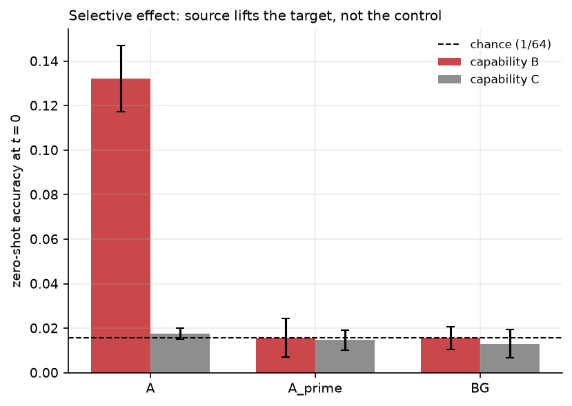
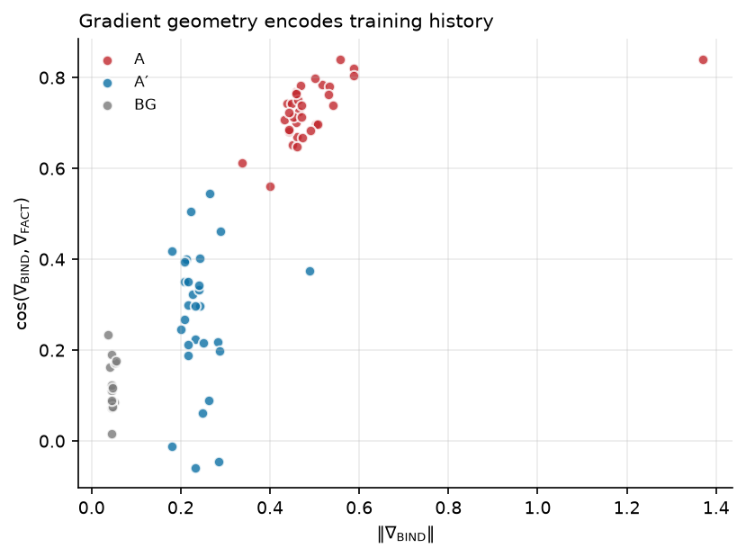
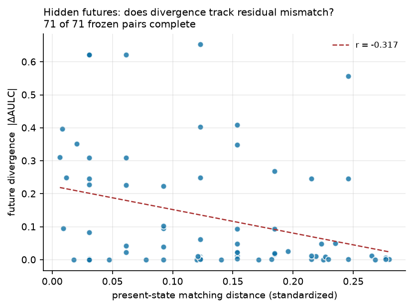
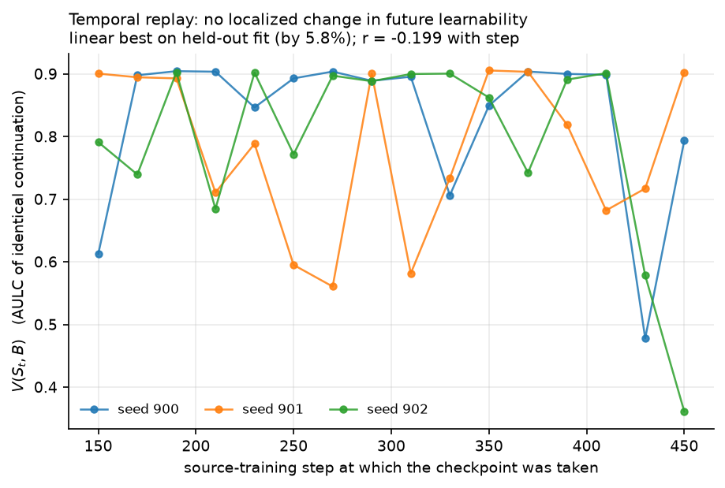

# Hidden Developmental State: Training History Shapes What Models Learn Next

**Patrick Walmsley**  
Walmsley Lab  
With Apart Research

*Research conducted at the Digital Minds Research Sprint, August 2026.*

## Abstract

Behavioral evidence alone may not fully characterize a digital mind. Two models with the same architecture—and potentially similar present behavior—can arrive there through different training histories, leaving latent differences that only become visible under future experience. We test this possibility in a controlled language-model training environment by measuring how prior training changes subsequent learnability. A source curriculum $A$ produces a large, selective advantage on a later binding task $B$, while matched control $A'$ and background training remain near chance at the start of $B$ training. The effect persists when source and target use disjoint entity identities, is absent on a learnable negative-control task, and survives a 32× model-capacity increase in exploratory runs. Our preregistered induction-style mechanistic hypothesis fails confirmatory testing. We then measure the value $V(S,D)$ of training on corpus $D$ from incoming model state $S$, finding strong State×Data interaction and ordering reversals: future experience has different value depending on the state produced by prior experience. However, current telemetry fails to predict that conditional value well enough to beat a global-best baseline. The result is a methodological foothold for studying hidden developmental state: history leaves consequential structure, but reading that structure remains an open problem.

## 1. Introduction

A central problem in the study of digital minds is that **behavioral evidence may underdetermine what kind of system we are observing**. A model can report preferences, describe internal states, or act as though it has stable interests, yet those outputs may not reveal whether the underlying system has a stable latent organization or is merely producing a context-dependent portrayal. The same concern applies across time: present behavior may not fully reveal **how a model will change under future experience**.

We study this temporal form of underdetermination. Two models can share an architecture and show similar present competence while having arrived there through different training histories. If those histories leave different internal states, then identical future data may produce different learning trajectories. This creates a concrete empirical question:

> **Does training history leave hidden developmental state that changes the value of future experience?**

This question is relevant to digital-minds research for two reasons. First, if present behavior does not fully determine future plasticity, then evaluations of preferences, identity, welfare-relevant signals, or self-reports may miss latent differences between otherwise similar model instances. Second, if future data has state-dependent value, then model development is better viewed as a state-transition process than as exposure to a fixed global curriculum.

We began with the simpler hypothesis that pairwise transfer relationships could be composed into a useful static training order. That program failed reliably enough to force a change in framing: pairwise effects did not compose cleanly, sequential block curricula produced coexistence failures, and balanced interleaving often dominated fixed orderings. These failures motivated a more general object:

$$V(S,D) = \text{the future learning value of data }D\text{ from model state }S.$$

Our main contributions are:

1. **A replicated history-dependent learnability effect.** Prior training on $A$ produces a large and selective advantage on future task $B$, while matched and background controls remain near chance.
2. **Controls against simple explanations.** The effect is specific rather than generic, survives disjoint source/target identities, and persists across a 32× capacity range in exploratory scale tests.
3. **Evidence that future experience is state-dependent.** A balanced $V(S,D)$ matrix shows substantial State×Data interaction and ordering reversals: the best future corpus is not globally fixed across measured states.
4. **Disciplined negative results that localize the frontier.** Our first mechanistic explanation fails confirmatory testing, and current telemetry fails to predict conditional corpus value well enough to steer training. The phenomenon is measurable; the missing piece is a reliable readout of developmental state.

**[P1 placeholder — Hidden Futures.]** If the prospective matched-state continuation experiment resolves before submission, insert one sentence here summarizing whether models matched on present observables nevertheless diverge under identical future experience.

**[P2 placeholder — Temporal Replay.]** If the prospective replay resolves before submission, insert one sentence here summarizing whether future learnability changes smoothly or within a localized training window.

## 2. Related Work

This work sits at the intersection of **curriculum and training-order research**, **developmental learning dynamics**, **training-data attribution and adaptive data selection**, and **methods for reading hidden model state**. Our central claim is narrower than any one of these literatures: we use controlled future learning as an external assay of history-dependent model state, then ask whether the value of future data depends on that state.

### 2.1 Curriculum, ordering, and prerequisites

Classical curriculum learning established that ordering examples can alter optimization and generalization in non-convex models (Bengio et al., 2009), while later work automated curriculum choice using learning-progress signals (Graves et al., 2017) and examined when curricula help in deep networks (Hacohen & Weinshall, 2019; Wu et al., 2021). Critical-period work goes further by showing that what happens early in training can change what is learnable later, even when later experience is held fixed (Achille et al., 2019; Frankle et al., 2020).

For language models, Skill-It formalizes ordered skill relations in terms of associated data and uses prerequisite structure for more data-efficient training (Chen et al., 2023). Procedural Pretraining shows that front-loading abstract structured data can materially accelerate subsequent acquisition of natural language, code, and mathematics (Jiang et al., 2026). The Implicit Curriculum Hypothesis finds that skills emerge in reproducible compositional order across model families and that internal representations predict held-out skill trajectories (Liu et al., 2026). Related theoretical and synthetic work studies emergence, compositional skill structure, and hierarchical skill acquisition (Arora & Goyal, 2023; Michaud et al., 2023; Lubana et al., 2024; Liu et al., 2025; Michaud et al., 2025).

These works motivate our original pairwise-transfer framing, but our experiments push toward a different object. A fixed prerequisite graph or curriculum treats data value as approximately global or pairwise. We instead ask whether the same future corpus can have different marginal value from different incoming model states.

### 2.2 Developmental stages, hidden progress, and training history

A separate literature suggests that neural-network learning is often stagewise and that internal development can precede visible behavioral change. Hidden-progress studies show that SGD can make systematic internal progress that is invisible to standard loss and error metrics (Barak et al., 2022), while mechanistic analyses of grokking identify internal progress measures that precede sharp improvements in generalization (Nanda et al., 2023). Developmental-interpretability work links shifts in loss-landscape degeneracy to changes in transformer computation and behavior, identifying distinct developmental stages during training (Hoogland et al., 2025). Factual-learning studies similarly find multi-phase acquisition dynamics tied to circuit formation and data distribution (Zucchet et al., 2025).

Training history can also remain directly readable. Krasheninnikov et al. (2025) show that language-model activations linearly encode the recency/order in which information was acquired. Influence Dynamics and Stagewise Data Attribution argues that training-example influence itself is dynamic: influence can change non-monotonically, including sign reversals and peaks near developmental transitions (Lee et al., 2025). These results support the broader premise that a checkpoint is not adequately summarized by its current loss or behavior.

Our contribution is complementary. Rather than defining hidden state from an internal representation alone, we operationalize it through **counterfactual future plasticity**: if two histories produce models that look similar now but respond differently to identical future training, then present behavior is not a complete description of their developmental state.

### 2.3 Circuits, mechanisms, and developmental readouts

Mechanistic interpretability asks which internal computations support behavior. Olsson et al. (2022) connected the emergence of induction heads to a sharp transition in in-context learning, with strong causal evidence in small attention-only transformers and more correlational evidence in larger models. Goodfire's parameter-interpretation work extends interpretability from activations into parameter space, identifying structured parameter directions and decompositions that can be used to understand and edit behavior (Bushnaq et al., 2026). Mechanistic Data Attribution explicitly connects training samples to the emergence of interpretable circuits, and shows that targeted changes to attributed data can accelerate or suppress circuit formation (Chen et al., 2026).

This line of work motivated our attempt to read developmental state directly. Our first induction-style mediator was falsified, and our later retrieval/gradient markers are treated cautiously: a signal that distinguishes histories is not automatically a signal that predicts which future data is valuable. This distinction is central to our negative result on adaptive selection.

### 2.4 Data attribution, data value, and adaptive pretraining

A broad literature asks which training data matters. Datamodels learn simple surrogates that predict counterfactual model outputs under changes to the training set (Ilyas et al., 2022), and TRAK provides scalable training-data attribution for model behavior (Park et al., 2023). DoReMi optimizes a global domain mixture and demonstrates large pretraining-efficiency gains (Xie et al., 2023), while Rho-1 performs token-level selective language modeling based on estimated utility (Lin et al., 2024). These are strong reminders that useful data selection does not require an explicit developmental-state model.

More directly related to our long-run objective, MATES adapts a learned data-influence model to the evolving pretraining model and selects data predicted to be most useful at the current stage (Yu et al., 2024). Group-MATES learns relational group-level data influence from sampled language-model training trajectories and uses the learned model for group-level selection (Yu et al., 2025). Gu et al. (2025) formulate language-model data selection as an optimal-control problem over training dynamics. Data-mixing-law work likewise shows that outcomes under unseen domain mixtures can sometimes be predicted from a small number of training runs (Ye et al., 2024).

These papers substantially narrow the novelty we claim. We do **not** claim that model-aware data selection, dynamic data utility, or optimal-control views of pretraining are new. Our narrower contribution is to isolate a controlled **State×Data continuation-value** phenomenon and to require a state readout to beat strong global baselines before allowing adaptive control. In our experiments, that second step fails: conditional structure exists, but our current telemetry does not exploit it well enough to steer training.

### 2.5 Digital minds, self-report, and behavioral underdetermination

The digital-minds framing raises a related methodological question: how much can present behavior tell us about a model's underlying state? Perez & Long (2023) argue that model self-reports could eventually contribute evidence about morally significant internal states, while emphasizing that present systems' reports are often spurious and should be corroborated with consistency tests and interpretability. Binder et al. (2025) find evidence of limited privileged self-prediction in language models, but report failures on more complex and out-of-distribution settings. Causal activation-intervention work likewise finds limited but unreliable introspective awareness, while stressing that conversational self-description alone cannot distinguish genuine introspection from confabulation (Lindsey, 2025).

Persona-vector work provides a concrete example of behaviorally relevant internal state: linear activation directions can monitor and control character traits, predict training-induced personality shifts, and flag data likely to cause those shifts (Chen et al., 2025). This does not establish a general theory of model identity, but it shows that training history and future behavioral change can sometimes be connected through readable internal variables.

We therefore treat controlled future learning as a **complementary external assay** rather than a replacement for self-report or mechanistic interpretability. If two models that look similar now diverge under identical future experience, that divergence reveals a hidden difference without requiring the model to describe itself. This is not evidence of consciousness, welfare, or stable preferences by itself; it is a method for testing whether present behavioral equivalence masks differences in future plasticity.

### 2.6 Positioning of the present work

Taken together, prior work already establishes that curricula can matter, learning can proceed in stages, training history can leave readable traces, data influence can vary over training, and model-aware selectors can improve pretraining efficiency. The remaining gap we target is more specific: **can controlled future learning be used to identify consequential hidden state, and can that state eventually support reliable prediction of which data should come next?**

Our current results support the first half more strongly than the second. History changes future learnability, and measured data value depends on incoming state; however, our current state telemetry does not yet outperform a strong global-best baseline. We therefore view this paper as establishing a developmental phenomenon and a disciplined frontier, not as presenting a finished adaptive curriculum algorithm.

## 3. Methods

### 3.1 Controlled training environment

We train small decoder-only language models from scratch on synthetic language-like corpora using ordinary next-token prediction. The controlled environment lets us vary source history while holding architecture, token budgets, and downstream data fixed.

The principal source conditions are:

- **$A$:** training that encourages stable entity–value retrieval/binding structure.
- **$A'$:** a matched control designed to preserve surface statistics while disrupting the source structure hypothesized to matter.
- **BG:** background training, providing a non-$A$ baseline.

After source training, all arms receive the same target continuation.

The primary target **$B$** is a novel binding/retrieval task using resampled identities so correct answers cannot be memorized as fixed associations. A negative-control task **$C$** is a learnable parametric association task designed not to require the same contextual retrieval structure.

We report:
- **$t=0$** target performance before any target training;
- **AULC**, area under the target learning curve;
- **final performance**;
- rate-only quantities where relevant.

This decomposition is important because head-start and learning-rate effects can move differently and can be more reproducible than a single aggregate transfer statistic.

### 3.2 Confirmatory discipline

Discovery, calibration, and confirmation seeds are separated. Gates are frozen before confirmatory runs. Contaminated runs are discarded rather than salvaged. Compound gates are reported as failed if any required criterion fails.

This discipline mattered repeatedly. A dramatic single-seed spike in our first mediator disappeared on fresh seeds. A later causal ablation produced a null interaction, but an intervention-efficacy check showed that the manipulation did not measurably reduce the capability; we therefore report causal mediation as inconclusive rather than negative.

### 3.3 Content-disjointness and specificity controls

To test memorization/content overlap, we repeat the source→target experiment with zero shared entity identities between source and target.

To test whether $A$ simply improves learning generally, we evaluate the learnable negative-control task $C$. The control is only interpreted once background training demonstrates that $C$ itself is learnable.

### 3.4 Scale

We replay the core behavioral contrast at approximately 1×, 8×, and 32× non-embedding parameter capacity. These runs are exploratory rather than a fully powered scaling study.

### 3.5 State-conditioned data value

We define

$$V(S,D)$$

as the measured learning value of continuing from saved model state $S$ on future corpus $D$, using the same continuation protocol and fresh optimizer state. This isolates the contribution encoded in the model weights; a future extension will compare restored optimizer state.

We construct a balanced matrix of incoming states × candidate corpora and decompose variance into:

1. state main effect;
2. data main effect;
3. State×Data interaction.

The strongest qualitative signature is an **ordering reversal**:

$$\arg\max_D V(S_1,D) \neq \arg\max_D V(S_2,D).$$

This demonstrates that a single globally best corpus is insufficient over the measured states.

### 3.6 Prediction gate

We separately test whether telemetry can predict conditional corpus value on held-out states. Leave-one-state-out evaluation is used rather than row-wise splitting to avoid leaking a state’s value profile through measurements on other corpora.

A state-aware selector must beat:
- random selection; and
- the **global-best corpus** baseline.

Beating random alone is insufficient: it can be achieved by learning only the data main effect.

### 3.7 Active prospective experiments

**Hidden Futures (P1).** We generate fresh states, select pairs using current observables only (accuracy, loss, capability vector), freeze and hash the pair list before any continuation outcomes exist, and then give each pair identical fresh continuations. The target is to test whether models that look similar now can nevertheless have different future learning trajectories.

**Temporal Replay (P2).** An exploratory held-out model comparison on zero-shot $B$ competence favored a changepoint description near source step $270$. Because competence is not the same as future learnability, we prospectively save dense checkpoints around the preidentified region and give each checkpoint an identical $B$ continuation to measure $V(S_t,B)$ directly.

### 3.x What the model sees, and what it does zero-shot

### What the model actually sees

Every stream shares one template — `the <entity> is <value> .` — so no
stream is identifiable from surface form. Only the *relationship* differs.

**`BIND`** — the queried entity **appears earlier**; the answer must be retrieved from context

```
prompt : <bos> the e276 is v54 . the e414 is v22 . the e447 is v1 . the e364 is v9 . the e110 is v8 . the e170 is v19 . the e383 is v60 . the e276 is
target : v54
```

**`FACT`** — the queried entity does **not** appear earlier; the answer is a globally fixed association held in the weights

```
prompt : <bos> the e276 is v54 . the e414 is v22 . the e447 is v1 . the e364 is v9 . the e110 is v8 . the e170 is v19 . the e383 is v60 . the e58 is
target : v41
```

**`BINDT`** — as BIND, but the answer is a fixed permutation of the bound value — retrieval alone gives the wrong token

```
prompt : <bos> the e276 is v54 . the e414 is v22 . the e447 is v1 . the e364 is v9 . the e110 is v8 . the e170 is v19 . the e383 is v60 . the e276 is
target : v33
```

### The same prompt across training histories

One example is not evidence at these accuracies, so the table reports 256
BIND prompts. Neither model has had **any** target-phase training: this is
zero-shot.

| history | exact answer correct | prediction is a value from the context |
|---|---|---|
| `A` | 0.113 | 1.000 |
| `A_prime` | 0.008 | 0.133 |
| `BG` | 0.004 | 0.074 |
| *chance* | 0.016 | 0.109 |

The second column is the more mechanistic one. Getting the exact binding
right is hard; **restricting the answer to values that appear in the context**
is the retrieval behaviour itself, and it separates the histories much more
sharply than exact accuracy does.

A single illustrative prompt, chosen as the first of the sample (not for
outcome). The correct answer is the value bound to the queried entity
earlier in the same context:

```
prompt : ... the e276 is ___
correct: v29

context values available: v29 v55 v16 v52 v21 v36 v62

A        wrong    top-3: v55 0.17  v21 0.17  v16 0.13   (3/3 drawn from context)
A_prime  wrong    top-3: v46 0.02  v60 0.02  v32 0.02   (0/3 drawn from context)
BG       wrong    top-3: v50 0.02  v61 0.02  v53 0.02   (0/3 drawn from context)
```

On this example every model gets the exact value wrong. What differs is
*where the guesses come from*, which is what the table quantifies.




> **Figure 4.** The confirmed selective effect at $t=0$: the source arm lifts the
> target capability while leaving the negative control at chance. Both controls
> sit on the chance floor for the target.



> **Figure 5.** Gradient geometry separates training histories cleanly. This is a
> state/history **marker**; it did not resolve as a predictor of $V(S,D)$ (§4.x).

## 4. Results

### 4.1 Training history changes future learnability

On fresh confirmatory seeds, $A$ creates a large $B$ advantage before any $B$ training:

| Arm | $B$ at $t=0$ |
|---|---:|
| $A$ | $0.1322 \pm 0.0149$ |
| $A'$ | $0.0156 \pm 0.0087$ |
| BG | $0.0156 \pm 0.0051$ |

Chance is $0.0156$. The $A$ arm is therefore roughly 8.5× chance while both controls sit at the chance floor.

The learning-curve advantage is also substantial:

$$\mathrm{AULC}(A)-\mathrm{AULC}(A') = +0.5265,$$

with effect/noise $+1.75$.

### 4.2 The effect is selective

The negative-control task $C$ shows little corresponding advantage:

$$\mathrm{AULC}_C(A)-\mathrm{AULC}_C(A') = +0.0395,$$

effect/noise $+0.36$, approximately thirteen times smaller than the $B$ effect.

This null is meaningful because the control is learnable: BG reaches FACT performance $0.410$ against the pre-specified $0.30$ competence gate.

### 4.3 The effect is not memorized entity content

With zero shared entity tokens between source and target, the $B$ head start is fully retained:

$$0.1567_{\text{disjoint}} \quad \text{vs.} \quad 0.1431_{\text{shared}},$$

or 111% retention.

This rules out simple entity memorization/content reuse as the explanation.

### 4.4 Exploratory scale persistence

The zero-shot $B$ advantage persists as capacity increases:

| Scale | $A$ $t=0$ | $A'$ $t=0$ | BG $t=0$ |
|---|---:|---:|---:|
| 1× | $0.126 \pm 0.016$ | $0.014 \pm 0.004$ | $0.021 \pm 0.006$ |
| 8× | $0.157 \pm 0.042$ | $0.012 \pm 0.007$ | $0.017 \pm 0.001$ |
| 32× | $0.097 \pm 0.037$ | $0.012$ | — |

These runs are exploratory, but they argue against the effect being purely a tiny-model artifact.

### 4.5 Our first mechanistic hypothesis is falsified

We hypothesized that an off-distribution induction-style mediator $M$ would be selectively increased by $A$ and explain the $A\rightarrow B$ advantage.

On fresh confirmatory seeds:
- amplitude ratio: $1.63$ vs gate $\ge 2.0$;
- selectivity: $0.76$ vs gate $\ge 2.0$.

The compound gate therefore **fails**.

This falsification is important methodologically. A single preflight seed had shown a visually convincing transient spike, but the effect disappeared across fresh seeds and scales. We retain the behavioral phenomenon and reject the proposed explanation.

### 4.6 State×Data interaction is real

We next measured $V(S,D)$: the value of future corpus $D$ from incoming model state $S$.

In the audited balanced matrix, State×Data interaction accounts for a large share of observed variation, comparable to or larger than the state main effect and much larger than the data main effect under the interpretable mean objective. Corpus ordering reverses across states: different corpora are optimal from different complete incoming states.

**Interpretation:** the value of training data is not globally fixed over the measured state space. Knowing only which corpus is generally best is insufficient to describe all state-conditioned outcomes.


> **Figure 1.** $V(S,D)$ over complete states and candidate corpora, each row centred on that state's mean so reversals are visible. ★ marks the best corpus for each state; different states select different corpora.

### 4.7 Current telemetry does not exploit the interaction

A state-aware selector evaluated on held-out states fails to beat the global-best corpus baseline.

Under the mean objective:

| Selector | Top-1 | Regret |
|---|---:|---:|
| State-aware | 10/12 | 0.0473 |
| Global-best | 11/12 | 0.0207 |
| Random | — | 0.0758 |

The predictor beats random but performs substantially worse than global-best. It therefore appears to learn broad corpus quality rather than the State×Data conditionality.

This is a **falsified adaptive-selection claim**, not a failure of the State×Data phenomenon itself. The combination localizes the bottleneck: conditional training structure exists, but our current state representation does not read it well enough to act.

### 4.8 Candidate state marker and causal limitation

An on-distribution retrieval statistic discovered during mechanism search separates $A$ from $A'$ on fresh validation seeds, but specificity against BG does not cleanly replicate. We therefore treat it as a history-associated marker rather than an $A$-specific mediator.

A targeted top-4-head output ablation does not preferentially remove the $A$ advantage. However, the intervention also fails to reduce the underlying zero-shot $B$ capability, despite verified zeroed weights. The necessity test is therefore **inconclusive due to insufficient intervention efficacy**, not evidence against mediation.

### 4.9 Exploratory temporal clue

Before the true temporal replay, we fit frozen temporal descriptions to zero-shot $B$ competence traces at 250-step intervals.

| Model | Held-out RMSE |
|---|---:|
| Linear | $0.0331 \pm 0.0037$ |
| Sigmoid | $0.0353 \pm 0.0038$ |
| Changepoint | $0.0171 \pm 0.0036$ |

The changepoint description improves held-out RMSE by approximately 48%. **The inferred break location, however, carries no better than 250-step resolution:** the traces were sampled every 250 steps, so the fitted break lies between the first two samples and the agreement across folds measures consistency of that interpolation, not measurement precision. The defensible statement is that competence rises somewhere within the first 250 steps.

This is **not** evidence for a phase transition in future learnability: it models acquired competence, not $V(S_t,B)$. P2 tests the stronger question prospectively.

### 4.10 Pending prospective results

**P1 — Hidden Futures:**  
`[INSERT FINAL RESULT: frozen-pair matching quality, number of completed pairs, aggregate future-divergence effect, uncertainty/significance, and one sentence interpretation.]`



> **Figure 2.** Present-state matching distance against future divergence for the frozen pairs. The correlation is the confound check named in the analysis plan: if divergence tracked residual mismatch, the effect would be imperfect matching rather than hidden state.

**P2 — Temporal Replay:**  
P2 completed on all three seeds: 48 checkpoints across source steps 150–450 at
20-step spacing, each given an identical $B$ continuation.

**No localized change in future learnability was found.** Held-out
leave-one-seed-out comparison: linear RMSE **0.1333**, sigmoid 0.1416,
changepoint 0.1425. Linear wins by 5.8%, inside the margin the protocol
pre-declared as *not distinguishable*, and $V(S_t,B)$ correlates with
training step at $r=-0.199$ across a spread of 0.36–0.91. The variance is
dominated by training instability rather than by developmental position.

The experiment also invalidated the premise of its own window. Zero-shot
competence was already $\approx 0.13$ at step 150 and flat thereafter, so
the competence rise had completed before the window opened. Per the frozen
protocol, the window was **not** re-centred after this was observed: a break
outside the tested range is reported, not chased.

**Reading:** the temporal-localization hypothesis was tested prospectively and
not supported. This is a clean negative, and it withdraws the precision of the
earlier competence-based changepoint estimate.



> **Figure 3.** Source-training step against measured $V(S_t,B)$, 48 checkpoints across three seeds. No localized structure; a linear description wins on held-out fit by only 5.8%, inside the pre-declared not-distinguishable band.

### 4.x Gradient/update geometry (E4)

Because the activation-based readout failed to predict conditional data value,
and because the capability proved redundant across attention heads, we measured
a different observable family: the geometry of the gradient that candidate
future data induces on the current weights. For each saved state and each
candidate corpus, on **identical future minibatches**, we record gradient norm,
layerwise gradient-mass entropy, alignment between the gradient and the current
weights, and pairwise alignment between corpora's gradients.

**As a marker of training history, this separates states cleanly.** Gradient
norm on $B$ is 0.54 for source-trained states against 0.29 for the matched
control; $\cos(\nabla B,\nabla C)$ is $+0.73$ against $+0.19$.

**As a predictor of $V(S,D)$, the result is inconclusive, and we do not
promote it.** Under the pre-specified `min` objective the point estimate favours
the gradient readout (regret 0.0017 against the state-blind global-best rule's
0.0027; top-1 9/13 against 7/13), which is what the frozen gate asked. We record
that as the formal outcome and do not retroactively claim that uncertainty
separation was prespecified — it was not. We nonetheless treat the result as
scientifically unresolved, for four reasons stated together: the advantage is
0.0010 in absolute terms; the `min` objective had already been documented, prior
to this experiment, as sitting near the chance floor; a bootstrap over the 13
usable states gives a 95% CI of $[0.00000, +0.00285]$, reaching zero; and the
`mean` objective points the opposite way (regret 0.0436 against 0.0191, CI
$[-0.07362, +0.00000]$). Two objectives disagreeing, both with intervals
touching zero, at $n=13$, is not a readout result.

The binding constraint was the overlap between measured geometry (76 states) and
complete $V(S,D)$ rows (13 states), not the geometry itself. We did not
expand the experiment post hoc; a properly powered successor is specified as
E4b. **Experiment 6, the prospective what-next tournament, remains gated and
unrun.**

A predictive geometry would be a *readout* result — evidence that the
information is present and legible — not a mechanism claim.

## 5. Discussion and Limitations

### Discussion

Our central result is that **training history changes the future learning dynamics of an otherwise fixed architecture**. This effect is selective, survives disjoint content, and persists across a substantial exploratory capacity range.

More importantly, the State×Data experiment shows that future experience depends on the pairing between model state and data. This moves the question beyond “does curriculum order matter?” A static ordering assumes data has a roughly global value. Our results instead support a conditional object $V(S,D)$: what is useful next depends on what the model has already become.

This matters directly for digital-minds methodology. The sprint asks how we should interpret preferences, self-reports, personas, and identity when behavior alone may be ambiguous. Our results suggest that **future plasticity itself may be an informative property of model identity**. If two systems with similar present behavior respond differently to the same future experience, a behavioral snapshot is not a complete characterization of the system. This does not establish consciousness, welfare, or stable preferences, but it provides a concrete way to probe hidden differences that could matter for those questions.

There is also a practical implication for training. In principle, a system could inspect a checkpoint, predict which candidate data would have the greatest marginal value, train on it, and observe the resulting state. We do **not** demonstrate that controller here. Our state-aware selector fails against the global-best baseline. The important result is narrower and more useful scientifically: the conditional signal exists, while our present readout does not yet capture it.

### Limitations

**Controlled synthetic environment.** The strongest evidence comes from a deliberately constructed language-like microworld. This gives experimental control but does not establish that the same structure governs large natural-language pretraining.

**Breadth remains unresolved.** Disjoint entity identities rule out simple content memorization, but the current $A\rightarrow B$ effect may still be specific to a related computational family. A broader target-distance/developmental-radius experiment remains important.

**Scale evidence is exploratory.** Persistence through 32× capacity is encouraging but not a fully powered scaling law.

**Mechanism unresolved.** The first mechanism was falsified. A later retrieval marker is not established as causal, and the head-ablation intervention was too weak to test necessity.

**Prediction failed.** Strong State×Data interaction does not imply that current telemetry can predict the best next corpus. Our selector loses to the global-best baseline.

**Optimizer state reset.** Current $V(S,D)$ continuations restart optimizer state, so the experiment primarily measures information encoded in weights. A future comparison should restore full optimizer/training state.

**Temporal evidence is preliminary.** The initial changepoint result concerns zero-shot competence rather than future learnability. P2 is designed to distinguish those quantities.

### Future Work

The sprint’s broader questions about model identity, introspection, and the limits of behavioral evidence suggest a natural extension: treat controlled future learning as an *assay* of hidden model state, then ask whether that state predicts preference stability, self-report reliability, or persona persistence.

The next research program is naturally staged:

1. **See development.** Test behavior-matched hidden futures, map the temporal structure of $V(S_t,D)$, and measure how far the readiness effect generalizes across target distance.
2. **Read development.** Search for a state representation that predicts held-out conditional data value. Gradient/update geometry is a high-priority next hypothesis because the same corpus can induce different learning outcomes from different weight states.
3. **Explain development.** Perturb human-readable corpus properties and test `corpus feature → state change → future learnability`.
4. **Control development.** Only once state inference beats a global-best baseline should we rerun a frozen prospective “what should come next?” tournament.
5. **Close the loop.** If one-step prediction succeeds, repeat the observe → predict → choose → train cycle and compare against static curricula/data mixtures.

The long-run goal is an adaptive pretraining system:

$$S_t
\rightarrow
\hat V(S_t,D_1),\ldots,\hat V(S_t,D_n)
\rightarrow
D^*
\rightarrow
S_{t+\Delta}.$$

## 6. Conclusion

Training history leaves consequential structure in model weights. In our controlled environment, prior exposure creates a large and selective difference in future learnability that survives disjoint content and exploratory scale-up. The effect persists after our first mechanistic explanation is falsified.

Most importantly, the value of future training data depends strongly on the incoming model state. Yet our current telemetry cannot exploit that conditionality well enough to beat a global corpus baseline. This combination identifies a concrete frontier: **the developmental signal exists, but we do not yet know how to read it.**

This suggests a view in which current behavior is only a projection of a richer developmental state. For digital-minds research, that raises a concrete methodological possibility: characterize a model not only by what it says or does now, but by how its latent state constrains what it will become under controlled future experience. For training-system design, the same framework points toward adaptive curricula that choose data conditional on model state. We establish the first half of that opportunity—the conditional dynamics—and identify state readout as the unresolved bottleneck.

## Code and Data

- **Code repository:** https://github.com/walmsley-lab/ml-innovation-3-interpretability-sprint
- **Data:** Synthetic corpora are generated deterministically from the code and recorded seeds/configurations.
- **Artifacts:** Headline experiments can be regenerated from frozen protocols and seeds. Cached run artifacts are not required for conceptual reproduction; where available they accelerate exact result regeneration.
- **Reproducibility:** Frozen protocols, analysis plans, pair selections, and hashes are version-controlled; experiments can be rerun from the recorded specifications. Concretely, the repository tracks the protocol documents under `docs/experiments/` together with their SHA-256 digests and the selection artifacts they govern — including the P1 stopping rule, pair list (71 pairs and their matching distances), analysis plan, interpretation branches, and the counterfactual-fork pair and corpus selections. Each digest was recorded before the outcomes it governs existed, so the ordering of specification and result is checkable by a third party rather than asserted. `scripts/audit_claims.py` recomputes every headline figure from raw units.

## Author Contributions

Patrick Walmsley designed and carried out the experiments, audited the resulting
claims, and wrote the report independently.

Krysia Koneni, Trevor Harrison, and Augustus acted as a sounding board.

AI was used heavily in experimental design and execution; see Appendix B for the
specific roles.

## References

1. Achille, A., Rovere, M., & Soatto, S. (2019). **Critical Learning Periods in Deep Networks.** *International Conference on Learning Representations (ICLR).* https://openreview.net/forum?id=BkeStsCcKQ
2. Arora, S., & Goyal, A. (2023). **A Theory for Emergence of Complex Skills in Language Models.** arXiv:2307.15936.
3. Barak, B., Edelman, B. L., Goel, S., Kakade, S., Malach, E., & Zhang, C. (2022). **Hidden Progress in Deep Learning: SGD Learns Parities Near the Computational Limit.** *Advances in Neural Information Processing Systems 35*, 21750–21764. arXiv:2207.08799.
4. Bengio, Y., Louradour, J., Collobert, R., & Weston, J. (2009). **Curriculum Learning.** *Proceedings of the 26th International Conference on Machine Learning*, 41–48. https://doi.org/10.1145/1553374.1553380
5. Binder, F. J., Chua, J., Korbak, T., Sleight, H., Hughes, J., Long, R., Perez, E., Turpin, M., & Evans, O. (2025). **Looking Inward: Language Models Can Learn About Themselves by Introspection.** *International Conference on Learning Representations (ICLR).* arXiv:2410.13787.
6. Bushnaq, L., Braun, D., Clive-Griffin, O., Bussmann, B., Hu, N., Ivanitskiy, M., Linsefors, L., & Sharkey, L. (2026). **Interpreting Language Model Parameters.** Goodfire / MATS Technical Report.
7. Chen, J., Luo, Y., & Pan, L. (2026). **Mechanistic Data Attribution: Tracing the Training Origins of Interpretable LLM Units.** arXiv:2601.21996.
8. Chen, M. F., Roberts, N., Bhatia, K., Wang, J., Zhang, C., Sala, F., & Ré, C. (2023). **Skill-It! A Data-Driven Skills Framework for Understanding and Training Language Models.** arXiv:2307.14430.
9. Chen, R., Arditi, A., Sleight, H., Evans, O., & Lindsey, J. (2025). **Persona Vectors: Monitoring and Controlling Character Traits in Language Models.** arXiv:2507.21509.
10. Frankle, J., Schwab, D. J., & Morcos, A. S. (2020). **The Early Phase of Neural Network Training.** *International Conference on Learning Representations (ICLR).* https://openreview.net/forum?id=Hkl1iRNFwS
11. Graves, A., Bellemare, M. G., Menick, J., Munos, R., & Kavukcuoglu, K. (2017). **Automated Curriculum Learning for Neural Networks.** *Proceedings of the 34th International Conference on Machine Learning*, PMLR 70. arXiv:1704.03003.
12. Gu, Y., Dong, L., Wang, H., Hao, Y., Dong, Q., Wei, F., & Huang, M. (2025). **Data Selection via Optimal Control for Language Models.** *International Conference on Learning Representations (ICLR).* arXiv:2410.07064.
13. Hacohen, G., & Weinshall, D. (2019). **On the Power of Curriculum Learning in Training Deep Networks.** *Proceedings of the 36th International Conference on Machine Learning*, PMLR 97.
14. Hoogland, J., Wang, G., Farrugia-Roberts, M., Carroll, L., Wei, S., & Murfet, D. (2025). **Loss Landscape Degeneracy Drives Stagewise Development in Transformers.** *Transactions on Machine Learning Research.* arXiv:2402.02364.
15. Ilyas, A., Park, S. M., Engstrom, L., Leclerc, G., & Madry, A. (2022). **Datamodels: Predicting Predictions from Training Data.** *Proceedings of the 39th International Conference on Machine Learning.* arXiv:2202.00622.
16. Jiang, L., Shinnick, Z., van den Hengel, A., Saratchandran, H., & Teney, D. (2026). **Procedural Pretraining: Warming Up Language Models with Abstract Data.** arXiv:2601.21725.
17. Krasheninnikov, D., Turner, R. E., & Krueger, D. (2025). **Language Models' Activations Linearly Encode Training-Order Recency.** arXiv:2509.14223. (Accepted to ICLR 2026.)
18. Lee, J. H., Smith, M., Adam, M., & Hoogland, J. (2025). **Influence Dynamics and Stagewise Data Attribution.** arXiv:2510.12071.
19. Lin, Z., Gou, Z., Gong, Y., Liu, X., Shen, Y., Xu, R., Lin, C., Yang, Y., Jiao, J., Duan, N., & Chen, W. (2024). **Rho-1: Not All Tokens Are What You Need.** arXiv:2404.07965.
20. Lindsey, J. (2025). **Emergent Introspective Awareness in Large Language Models.** *Transformer Circuits Thread.*
21. Liu, E., Sun, K., Li, M., Lee, I., Tjuatja, L., Huang, J.-t., & Neubig, G. (2026). **What do Language Models Learn and When? The Implicit Curriculum Hypothesis.** arXiv:2604.08510.
22. Liu, Z., Liu, Y., Michaud, E. J., Gore, J., & Tegmark, M. (2025). **Physics of Skill Learning.** arXiv:2501.12391.
23. Lubana, E. S., Kawaguchi, K., Dick, R. P., & Tanaka, H. (2024). **A Percolation Model of Emergence: Analyzing Transformers Trained on a Formal Language.** arXiv:2408.12578.
24. Michaud, E. J., Liu, Z., Niklasson, U., & Tegmark, M. (2023). **The Quantization Model of Neural Scaling.** *Advances in Neural Information Processing Systems.*
25. Michaud, E. J., Parker-Sartori, A., & Tegmark, M. (2025). **On the Creation of Narrow AI: Hierarchy and Nonlocality of Neural Network Skills.** *Advances in Neural Information Processing Systems.* arXiv:2505.15811.
26. Nanda, N., Chan, L., Lieberum, T., Smith, J., & Steinhardt, J. (2023). **Progress Measures for Grokking via Mechanistic Interpretability.** *International Conference on Learning Representations (ICLR).* https://openreview.net/forum?id=9XFSbDPmdW
27. Olsson, C., Elhage, N., Nanda, N., et al. (2022). **In-context Learning and Induction Heads.** arXiv:2209.11895.
28. Park, S. M., Georgiev, K., Ilyas, A., Leclerc, G., & Madry, A. (2023). **TRAK: Attributing Model Behavior at Scale.** *Proceedings of the 40th International Conference on Machine Learning*, 27074–27113. arXiv:2303.14186.
29. Perez, E., & Long, R. (2023). **Towards Evaluating AI Systems for Moral Status Using Self-Reports.** arXiv:2311.08576.
30. Xie, S. M., Pham, H., Dong, X., Du, N., Liu, H., Lu, Y., Liang, P. S., Le, Q. V., Ma, T., & Yu, A. W. (2023). **DoReMi: Optimizing Data Mixtures Speeds Up Language Model Pretraining.** *Advances in Neural Information Processing Systems 36*, 69798–69818. arXiv:2305.10429.
31. Ye, J., Liu, P., Sun, T., Zhou, Y., Zhan, J., & Qiu, X. (2024). **Data Mixing Laws: Optimizing Data Mixtures by Predicting Language Modeling Performance.** arXiv:2403.16952.
32. Yu, Z., Das, S., & Xiong, C. (2024). **MATES: Model-Aware Data Selection for Efficient Pretraining with Data Influence Models.** *Advances in Neural Information Processing Systems 37*, 108735–108759. arXiv:2406.06046.
33. Yu, Z., Peng, F., Lei, J., Overwijk, A., Yih, W.-t., & Xiong, C. (2025). **Group-Level Data Selection for Efficient Pretraining.** arXiv:2502.14709.
34. Zucchet, N., Bornschein, J., Chan, S. C. Y., Lampinen, A. K., Pascanu, R., & De, S. (2025). **How Do Language Models Learn Facts? Dynamics, Curricula and Hallucinations.** arXiv:2503.21676.

### Further reading and adjacent precedents

The following works are useful context for readers pursuing the broader themes of hidden learning progress, multiple internal solutions, training dynamics, and data-dependent development:

- Geirhos, R., Jacobsen, J.-H., Michaelis, C., et al. (2020). **Shortcut Learning in Deep Neural Networks.** *Nature Machine Intelligence, 2*, 665–673.
- Hermann, K. M., & Lampinen, A. K. (2020). **What Shapes Feature Representations? Exploring Datasets, Architectures, and Training.** *Advances in Neural Information Processing Systems.*
- Nakkiran, P., Kaplun, G., Kalimeris, D., Yang, T., Edelman, B. L., Zhang, F., & Barak, B. (2019). **SGD on Neural Networks Learns Functions of Increasing Complexity.** *Advances in Neural Information Processing Systems 32.* arXiv:1905.11604.
- Pezeshki, M., Kaba, S.-O., Bengio, Y., Courville, A., Precup, D., & Lajoie, G. (2021). **Gradient Starvation: A Learning Proclivity in Neural Networks.** *Advances in Neural Information Processing Systems.*
- Shah, H., Tamuly, K., Raghunathan, A., Jain, P., & Netrapalli, P. (2020). **The Pitfalls of Simplicity Bias in Neural Networks.** *Advances in Neural Information Processing Systems.*
- Wu, X., Dyer, E., & Neyshabur, B. (2021). **When Do Curricula Work?** *International Conference on Learning Representations (ICLR).* 

## Appendix

### A. Claim-status summary

| Claim | Status |
|---|---|
| Training history produces a selective future-$B$ advantage | **Supported** |
| Effect is generic learning acceleration | **Not supported**; $C$ is near null |
| Effect is simple entity memorization | **Falsified by disjoint-content control** |
| Effect persists across 32× capacity | **Exploratory support** |
| Off-distribution induction mediator $M$ explains the effect | **Falsified** |
| Retrieval statistic is an $A$-specific causal mediator | **Not established** |
| Top-4 targeted ablation tests necessity adequately | **Falsified**; intervention ineffective |
| State×Data interaction exists | **Supported** |
| Current telemetry predicts conditional corpus value well enough to steer | **Falsified** |
| Prospective adaptive tournament is licensed | **No** |
| Hidden present-state differences predict future divergence | **P1 pending** |
| Future learnability changes near the ~270-step window | **P2 pending** |

### B. LLM Usage Statement

LLMs were used extensively throughout this sprint, in distinct roles:

- **Claude** — implementation. Wrote and debugged the experimental code, ran and
  orchestrated the experiments across cloud workers, built the analysis and audit
  tooling, and drafted documentation.
- **ChatGPT** — reasoning through the experimental design. Used to pressure-test
  hypotheses, sequence the experiments, and interrogate what each result could and
  could not support.
- **DeepSeek** — used sparingly for inspiration and review.
- **Kimi K3** and **Perplexity** — used to search for prior work and locate
  related literature.

Experimental protocols, frozen gates, raw outputs, and final claims were checked
against generated artifacts and independent audit scripts. LLM suggestions were
not treated as evidence; claims were promoted only when supported by the
corresponding experiments, and several LLM-proposed framings were discarded when
the frozen criteria did not support them.
