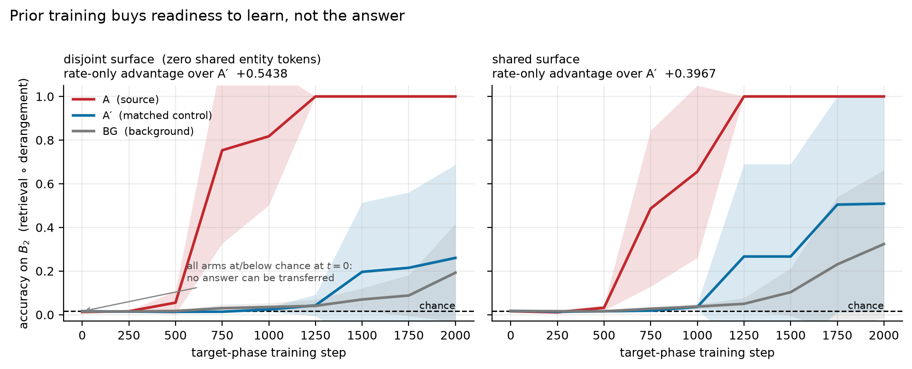
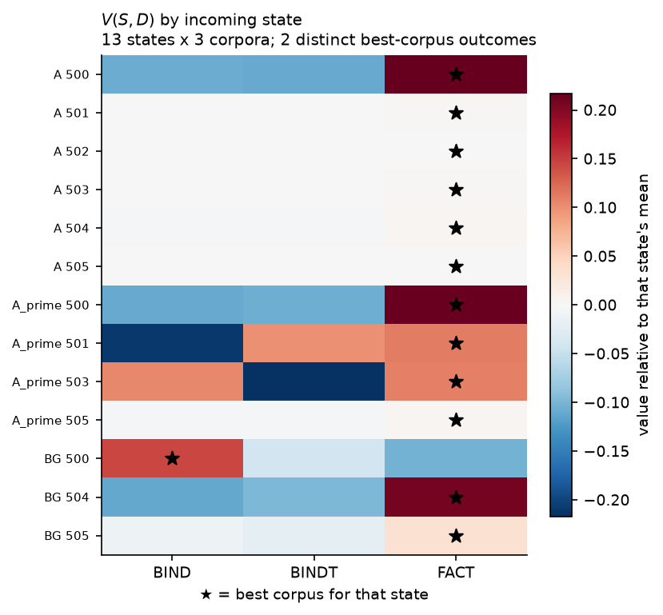
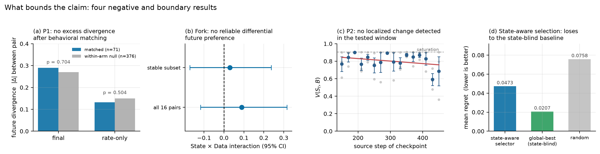

# Training History Shapes What Models Are Ready to Learn

**Patrick Walmsley**

## Abstract

Prior training changes what a model is *ready* to learn next. In a controlled
language-model environment, a source curriculum $A$ produces a large, selective
advantage in acquiring a later capability, while a control matched on every
low-order statistic and a background stream remain at chance. The advantage is
not memorized content — it survives zero shared entity tokens — and it is not
target competence: on a target composed with a fixed derangement, where
zero-shot transfer is blocked by construction and confirmed blocked at or below
chance, the source arm still learns dramatically faster. We call this
**developmental readiness** rather than task transfer. Readiness has a
consequence for data: measuring $V(S,D)$, the value of corpus $D$ from incoming
state $S$, we find a State×Data interaction with genuine ordering reversals.

Two pre-registered experiments then asked whether these differences hide behind
present behavior, and **neither detected reliable residual divergence**. States
matched on a modest behavioral vector showed no excess divergence under an
identical future (71 frozen pairs against a 376-pair null, the better-powered
test) and no reliable differential preference between futures (16 frozen pairs,
interaction CI spanning zero at chance sign agreement). The honest reading
narrows our starting hypothesis: readiness can be invisible to a single
capability measure without being deeply hidden from behavior in general. A
pre-registered mechanistic hypothesis failed, a prospective search detected no
localized transition in future learnability, and gradient geometry that cleanly
identifies training history did not resolve as a predictor of conditional data
value. History leaves consequential structure; reading it well enough to act on
remains open.

## 1. Introduction

A central concern in the study of digital minds is that **behavioral evidence
may underdetermine what kind of system we are observing**. A model can report
preferences or act as though it has stable interests without those outputs
revealing a stable latent organization. The concern extends across time: present
behavior may not reveal how a model will change under future experience.

We test that directly rather than assume it. Two models can share an
architecture and similar present competence while having arrived through
different histories. If those histories leave different internal states,
identical future data might produce different learning trajectories. This paper
answers that question — in one controlled setting, with a specific behavioral
vector — in the *negative*. What we did find is that training history matters a
great deal for future learning; what we did not find is that it matters
*invisibly*. We use **developmental state** operationally throughout: whatever
information in the current model predicts its response to future experience. We
do not assume it corresponds to consciousness, identity, or welfare.

We began by asking whether pairwise transfer relations could be composed into a
useful training order. Repeated failures — non-composing transfer effects,
interference under sequential curricula, and unreliable prospective prediction —
suggested that data value could not be treated as a fixed property of a corpus
pair. This motivated $V(S,D)$, the value of future data $D$ conditional on what
the model has already become.

Our contributions are: (1) **history-dependent developmental readiness**, shown
on a target the source model cannot answer at all beforehand, so what transfers
is readiness to learn rather than the answer; (2) **controls against simpler
explanations** — the effect is selective rather than generic, survives zero
shared entity tokens, and persists across a 32× capacity range in exploratory
runs; (3) **state-dependent future data value**, with ordering reversals in a
balanced $V(S,D)$ matrix; (4) **behavioral matching that is more sufficient than
expected**, the opposite of what we set out to show; and (5) **disciplined
negatives** that localize the frontier — the phenomenon is measurable, and the
missing capability is a reliable readout of developmental state.

## 2. Related Work

Classical curriculum learning established that ordering examples can alter
optimization and generalization in non-convex models (Bengio et al., 2009). For
language models, Skill-It formalizes ordered skill relations and uses
prerequisite structure for more data-efficient training (Chen et al., 2023), and
Procedural Pretraining shows that front-loading abstract structured data
materially accelerates later acquisition of natural language, code, and
mathematics (Jiang et al., 2026). A separate literature finds that learning is
often stagewise, with internal development preceding visible behavioral change:
loss-landscape degeneracy drives distinct developmental stages in transformers
(Hoogland et al., 2025), and training history can remain directly readable, as
activations linearly encode training-order recency (Krasheninnikov et al.,
2025). Mechanistic work connects the emergence of induction heads to a sharp
transition in in-context learning (Olsson et al., 2022), which motivated — and
supplied — our first, falsified, mediator hypothesis. These works motivate our
original pairwise framing, but a fixed prerequisite graph treats data value as
approximately global or pairwise; we instead ask whether the same future corpus
has different marginal value from different incoming states.

A parallel literature asks which training data matters and substantially narrows
the novelty we claim. Datamodels learn surrogates predicting counterfactual
outputs under training-set changes (Ilyas et al., 2022); DoReMi optimizes a
global domain mixture for large pretraining-efficiency gains (Xie et al., 2023);
MATES adapts a learned data-influence model to the evolving pretraining model
and selects data predicted most useful at the current stage (Yu et al., 2024);
and Gu et al. (2025) formulate data selection as optimal control over training
dynamics. We do **not** claim that model-aware selection, dynamic data utility,
or optimal-control views of pretraining are new. Our narrower contribution is to
isolate a controlled State×Data continuation-value phenomenon and to *require* a
state readout to beat strong global baselines before allowing adaptive control —
a step that fails here. On the digital-minds side, Perez & Long (2023) argue
self-reports could eventually bear on morally significant internal states while
stressing that present reports are often spurious, and persona-vector work shows
training history and future behavioral change can sometimes be connected through
readable internal variables (Chen et al., 2025). We treat controlled future
learning as a **complementary external assay**: if two models that look similar
now diverge under identical future experience, that divergence reveals a hidden
difference without requiring the model to describe itself.

## 3. Methods

### 3.1 Environment and conditions

We train small decoder-only language models from scratch on synthetic
language-like corpora using ordinary next-token prediction, varying source
history while holding architecture, token budgets, and downstream data fixed.
Every stream shares one surface template — `the <entity> is <value> .` — so no
stream is identifiable from surface form; only the *relationship* differs.

Source conditions are **$A$**, training that encourages stable entity–value
retrieval/binding; **$A'$**, a matched control preserving surface statistics
while disrupting that structure; and **BG**, background training. After source
training all arms receive the same target continuation.

Targets: **$B$** is a binding/retrieval task with resampled identities, so
answers cannot be memorized as fixed associations. **$B_2$** is the critical
one: retrieval composed with a **fixed derangement**, so the retrieved value is
never the correct answer. Zero-shot transfer is therefore blocked *by
construction*, and we confirm it blocked — every arm sits at or below chance
before target training. Any advantage on $B_2$ cannot be a transferred answer.
**$C$** is a learnable parametric-association negative control that does not
require contextual retrieval.

### 3.2 Metrics, controls, and confirmatory discipline

We report $t=0$ performance before any target training, AULC, final performance,
and rate-only quantities ($\mathrm{AULC} - t_0$). The decomposition matters
because head-start and rate effects move differently; an advantage in rate-only
with $t=0$ at chance is the pre-declared signature of *readiness*. Controls:
content-disjointness repeats source→target with zero shared entity identities;
specificity is tested against $C$, interpreted only once BG demonstrates $C$ is
learnable; and we replay the core contrast at roughly 1×, 8×, and 32×
non-embedding capacity.

Discovery, calibration, and confirmation seeds are separated; gates, analysis
plans, and pair selections are frozen and SHA-256 hashed *before* the outcomes
they govern exist; contaminated runs are discarded rather than salvaged; and
compound gates fail if any criterion fails. This repeatedly changed conclusions:
a dramatic single-seed spike in our first mediator vanished on fresh seeds, and
a later causal ablation returned a null interaction that we report as
**inconclusive** rather than negative, because an efficacy check showed the
intervention never measurably reduced the capability it was meant to remove.

### 3.3 State-conditioned data value and the prospective tests

$V(S,D)$ is the measured learning value of continuing from saved state $S$ on
corpus $D$, under an identical continuation protocol with fresh optimizer state
— isolating information carried in the weights. We build a balanced matrix of
incoming states × candidate corpora and decompose variance into state main
effect, data main effect, and State×Data interaction. The strongest qualitative
signature is an **ordering reversal**,
$\arg\max_D V(S_1,D) \neq \arg\max_D V(S_2,D)$.

A selector must beat both random and the **global-best corpus** baseline;
beating random alone is achievable by learning the data main effect only.
Validation is leave-one-**state**-out, never row-wise, which would leak a
state's value profile through its other corpora. Four prospective experiments
follow. **P1** selects pairs of fresh states on present observables only, freezes
and hashes the pair list, then gives each pair identical continuations. **Fork**
branches both members of matched pairs onto the two corpora with the strongest
prior ordering reversal, pre-registering a difference-in-differences estimand.
**P2** gives dense checkpoints across a pre-declared source window identical
continuations, measuring $V(S_t,B)$ directly rather than competence. **E4**
measures the geometry of the gradient candidate data induces on current weights,
on identical future minibatches.

## 4. Results

| Question | Result |
|---|---|
| Does history change future learnability? | **Supported** |
| Is it generic acceleration? | **Not supported** — control capability unmoved |
| Is it memorized content reuse? | **Ruled out** — survives zero shared tokens |
| Is it target competence, or readiness? | **Readiness** — zero-shot blocked, learning still accelerated |
| Does it survive scale? | **Supported (exploratory)**, 32× |
| Does future data value depend on state? | **Supported** — interaction with ordering reversals |
| Do behavior-matched states diverge under one future? | **None detected** — well-powered null (P1) |
| Do behavior-matched states prefer different futures? | **None detected** (Fork) |
| Is there a localized transition in future learnability? | **None detected** in the pre-registered window (P2) |
| Does internal geometry identify history? | **Supported** |
| Does it predict $V(S,D)$? | **Inconclusive** |
| Can we choose the best next corpus yet? | **Not yet** — loses to the state-blind baseline |

### 4.1 Developmental readiness

The clearest result is $B_2$, the deranged target. Because the derangement
blocks the retrieved answer, every arm begins at or below chance: $A$ scores
0.0122 (disjoint surface) and 0.0156 (shared) against a chance floor of 0.0156.
Nothing can be transferred. Yet the source arm learns far faster — a rate-only
advantage over the matched control of **+0.5438** on the disjoint surface
(effect/noise 1.86) and **+0.3967** shared (1.63), reaching final accuracy
**1.0000** against $A'$ at 0.26/0.51 and BG at 0.19/0.32 (24 units, 4 seeds ×
3 arms × 2 surface conditions). Per the pre-declared reading table, a rate-only
advantage with $t=0$ at chance is **readiness, not task transfer**. Caveats: $n
= 4$ per arm, effect/noise 1.6–1.9 rather than overwhelming, and the control arm
has large between-seed variance (sd 0.14–0.21).

On the ordinary target $B$, $A$ reaches $0.1322 \pm 0.0149$ at $t=0$ against
$0.0156 \pm 0.0087$ ($A'$) and $0.0156 \pm 0.0051$ (BG) — roughly 8.5× chance
while both controls sit exactly on the floor — with
$\mathrm{AULC}(A) - \mathrm{AULC}(A') = +0.5265$ (effect/noise $+1.75$).

> **Figure 1.** Acquisition of $B_2$ (retrieval ∘ derangement), mean ± sd over 4
> seeds per arm. Because the derangement blocks the retrieved answer, all arms
> begin at or below chance, so no answer can be transferred; the source arm
> nonetheless acquires the capability far faster, and the advantage is if
> anything larger when source and target share **zero** entity tokens (left).

### 4.2 Specificity, disjointness, and scale

The effect is not generic acceleration: on the negative control $C$ the
advantage is $+0.0395$ (effect/noise $+0.36$), roughly thirteen times smaller
than the $B$ effect. This null is meaningful because $C$ is learnable — BG
reaches 0.410 against a pre-specified 0.30 competence gate. It is not memorized
content: with zero shared entity tokens the head start is fully retained
($0.1567$ disjoint vs $0.1431$ shared, 111% retention). It persists with
capacity — zero-shot $B$ advantage of $0.126 \pm 0.016$ at 1×, $0.157 \pm 0.042$
at 8×, and $0.097 \pm 0.037$ at 32×, against controls that never leave the floor
— though these runs are exploratory rather than a powered scaling study.

### 4.3 State×Data interaction, and the readout that cannot exploit it

In the audited balanced matrix (13 complete states × 3 corpora), State×Data
interaction accounts for a large share of variation, comparable to or larger
than the state main effect and much larger than the data main effect. Corpus
ordering does reverse across states, though one corpus dominates globally: FACT
is optimal for 12 of 13 states and BIND for one, supplying the reversal. The
value of training data is therefore not globally fixed over the measured state
space — but a strong data main effect remains.

That caveat proves decisive. A state-aware selector evaluated leave-one-state-out
beats random (regret 0.0473 vs 0.0758) yet loses badly to the state-blind
**global-best** baseline (0.0207; top-1 10/12 against 11/12). It learns broad
corpus quality rather than the conditionality. This does not support the
adaptive-selection claim, and it is not a failure of the State×Data phenomenon:
the conditional structure exists, and our state representation does not read it
well enough to act.

> **Figure 2.** $V(S,D)$ with each row centred on that state's own mean, so cells
> compare candidate corpora *within* a state rather than absolute value across
> states. ★ marks the best corpus per state. FACT is globally dominant and
> optimal for 12/13 states; BIND is optimal for BG-500, yielding the ordering
> reversal. The interaction is real but was not readable enough for state-aware
> selection to beat the global-best baseline. (This audited matrix uses three
> corpora; the powered E4b successor specifies four.)

### 4.4 Boundaries and negative results

**Behavior-matched states do not diverge under an identical future (P1).** We
froze and hashed the pair list, stopping rule, analysis plan, and interpretation
branches before any continuation outcome existed; all **71 frozen pairs**
completed as a contiguous prefix of a pre-declared run order, so no subsampling
decision arose. Against a within-arm null of 376 unmatched pairs, matched pairs
do not diverge more: final 0.2893 vs 0.2700 ($+0.0193$, permutation $p = 0.704$)
and rate-only 0.1325 vs 0.1496 ($-0.0171$, $p = 0.504$). Both survive dropping
units with a late instability dip ($p = 0.951$, $0.701$). A significant $t=0$
result ($p = 0.005$) is **circular rather than a finding**: zero-shot accuracy is
part of the matching vector, and matching distance correlates with $t=0$
divergence at $+0.802$. The metrics *not* matched on show nothing.

**Nor do they prefer different futures (Fork).** Forking both members of 16
frozen matched pairs onto the two corpora with the strongest prior ordering
reversal gives an aggregate interaction of $+0.0888$, 95% CI
$[-0.1173, +0.3162]$ — spanning zero, with a standard deviation five times the
mean. **8 of 16 pairs share the aggregate sign, exactly chance**, so the apparent
reversals are what random sign assignment produces; the stable subset gives
$+0.0295$, CI $[-0.1707, +0.2368]$. The single most extreme pair looks striking,
and the protocol pre-committed to not presenting the maximum of a noise
distribution as a result.

**No localized transition detected (P2).** An exploratory changepoint fit on
zero-shot competence had suggested a localized early change. Because competence
is not learnability, we tested prospectively: 48 checkpoints across source steps
150–450, each given an identical continuation. Held-out comparison gives linear
0.1333, sigmoid 0.1416, changepoint 0.1425 — linear wins by 5.8%, inside the
pre-declared not-distinguishable band — and $V(S_t,B)$ correlates with source
step at only $r = -0.199$. The experiment also invalidated its own window's
premise: the original changepoint was fitted to traces sampled every 250 steps,
so its location carries no better than 250-step resolution. Per the frozen
protocol the window was **not** re-centred.

**Mechanism and geometry.** Our pre-registered induction-style mediator $M$
failed its compound gate on fresh seeds (amplitude ratio 1.63 and selectivity
0.76, both against a $\ge 2.0$ gate). A later on-distribution retrieval statistic
separates $A$ from $A'$ but does not cleanly replicate against BG, so we treat it
as history-associated rather than $A$-specific. Gradient geometry separates
histories cleanly — gradient norm on $B$ of 0.54 for source-trained states
against 0.29 for the matched control, $\cos(\nabla B, \nabla C)$ of $+0.73$
against $+0.19$ — but as a *predictor* of $V(S,D)$ it is **inconclusive and not
promoted**. Under the pre-specified `min` objective the point estimate favours it
(regret 0.0017 vs 0.0027; top-1 9/13 vs 7/13), which is what the frozen gate
asked, and we do not retroactively claim uncertainty separation was
pre-specified. We nonetheless treat it as unresolved: the advantage is 0.0010
absolute; `min` had already been documented before this experiment as near the
chance floor; the bootstrap CI over 13 states is $[0.00000, +0.00285]$, reaching
zero; and the `mean` objective points the opposite way (0.0436 vs 0.0191, CI
$[-0.07362, +0.00000]$). Two objectives disagreeing, both touching zero, at
$n=13$, is not a readout result. The binding constraint was overlap between
measured geometry (76 states) and complete $V(S,D)$ rows (13); we did not expand
post hoc, and the prospective what-next tournament **remains gated and unrun**.

> **Figure 3.** The four results that bound the claim. **(a)** P1: matched-pair
> divergence does not exceed the within-arm null on either informative metric.
> **(b)** Fork: the State×Data interaction CI spans zero. **(c)** P2: no
> localized structure in $V(S_t,B)$; note that all 48 continuations reach BIND
> accuracy 1.0, so the assay saturates near 0.905 and the visible spread is
> post-mastery instability rather than differences in what was learnable.
> **(d)** the state-aware readout loses to the state-blind global-best baseline.

## 5. Discussion and Limitations

We began by asking whether training order could be reduced to a static
curriculum relation. Our experiments pushed us beyond one: past data changes the
learner, and therefore changes the value of future data. That is why $V(S,D)$
exists as an object here, and it is a shift the results forced rather than one
we assumed.

**The central synthesis is about which measurements capture what.** A single
capability score badly underestimates readiness: on $B_2$ the source model
performs at or below chance zero-shot — it can do nothing — and nonetheless
acquires the capability far faster than either control, even across disjoint
content. Judging that model by what it can currently do would miss the
difference entirely. Yet the *richer* behavioral vector we matched on —
zero-shot accuracy and loss across two capabilities — was enough that neither
prospective test detected reliable residual divergence. These carry different
weight: P1 is well powered, with 71 frozen pairs against a 376-pair null, and is
the stronger of the two; the Fork, at 16 pairs, is a smaller test whose interval
is correspondingly wide and which mainly fails to add evidence rather than
subtracting it. The formulation we can defend is narrow: **developmental
readiness can be invisible to a single capability measure without being deeply
hidden from behavior in general.**

This reframes the digital-minds question from *does behavior hide developmental
state?* to **which present measurements are sufficient to forecast future
plasticity?** Our results do not show that behaviorally similar systems harbour
hidden future divergence; they show that in this setting a modest
multi-capability profile was already sufficient to account for it, while a
single competence score was not. The same distinction bites on the internal
side: gradient geometry cleanly identifies which history produced a state, and
that is **history recognition, not prediction of future consequences** — a
representation can classify the past perfectly and still forecast conditional
data value at chance. The trajectory this work traces — static curriculum →
state-conditioned value → predictive state readout → adaptive control — is
therefore complete only through its first two stages. We do not demonstrate a
controller, and we do not claim a readout.

**Limitations.** "Developmental state" is operational, not uniquely identified:
nothing here establishes a low-dimensional latent coordinate, a discrete stage,
or Markovian dynamics. The behavioral-sufficiency result is a boundary
condition, not a universal claim — it holds for *this* matching vector, in
*this* microworld, at *this* scale, over *these* futures, and a richer future
set, coarser vector, different substrate, or larger model could reverse it. The
synthetic environment is what makes the controls possible and is also the
clearest gap between this setting and the phenomena the digital-minds framing
cares about. Breadth remains unresolved: disjoint identities rule out content
memorization, but the effect may still be specific to a related computational
family. Scale evidence is exploratory, mechanism is unresolved, prediction was
not achieved, and $V(S,D)$ continuations reset optimizer state, measuring
information in weights rather than full training state. Finally, the P2 assay
saturates — all 48 continuations reach ceiling on the target — which leaves
little headroom to distinguish "very ready" from "extremely ready." That is an
**assay limitation**: it bounds what P2 could have detected, and it is not
evidence that no temporal structure exists.

### Dual-Use and Ethical Considerations

Most experiments were conducted on small, simple models and synthetic tasks
designed to expose training dynamics directly. Sensitive or welfare-relevant
topics were not required to elicit history-dependent differences in later
learning, and the study does not rely on conversational self-report or
preference elicitation. Instead, we construct the relevant training histories
directly and intervene on prior experience while holding architecture and
subsequent training fixed, providing a ground-truth record of developmental
history and a causal test of whether that history changes later learnability. We
therefore establish a causal relationship between training history and future
learning dynamics in this controlled setting. We do **not** establish
ground-truth preferences, introspective access, subjective experience, moral
status, or a uniquely identified internal developmental state.

### Future Work

The next question is whether developmental readiness remains behaviorally
legible in semantically richer environments. Our microworld removes connotation
to isolate learning dynamics, but early experience may establish latent
dispositions that become behaviorally meaningful only when later experience
supplies the relevant context. This motivates a **history × environment** test:
vary developmental history, hold the later semantic environment fixed, and ask
whether identical experience elicits different preferences, interpretations, or
behavioral tendencies. Such a setting also provides a harder test of our
behavioral-matching nulls, since a modest capability profile may be sufficient
in a connotation-free microworld but not where later experience can activate
dispositions laid down earlier. In parallel, adaptive control requires a state
representation that predicts held-out $V(S,D)$, adds information beyond
behavior, and beats a global-best baseline. Only after that succeeds should
prospective what-next selection be attempted.

## 6. Conclusion

Training history changes not only what a model can do, but what it is ready to
learn next. We find a large, selective readiness advantage that survives
disjoint content and appears even when the target capability is absent before
training, while future data value varies with incoming model state. Yet the
stronger hidden-state story did not survive: behavior-matched states showed no
reliable residual divergence, no localized transition in future learnability was
detected, and internal geometry that encoded history did not reliably forecast
conditional data value. The resulting distinction is sharper than our starting
hypothesis: present competence can miss consequential readiness, but those
consequences may be more behaviorally legible than expected. The open problem is
therefore not merely to detect training history, but to identify measurements
sufficient to predict how a model will respond to future experience.

## Code, Data, and Licensing

- **Code repository:** https://github.com/walmsley-lab/ml-innovation-3-interpretability-sprint
- **Data:** synthetic corpora are generated deterministically from the code and recorded seeds/configurations.
- **Reproducibility:** experimental protocols, analysis plans, configurations, and selected frozen artifacts are version-controlled in the repository. The code and recorded seeds support reproduction of the main experiments and analyses. For prospective experiments, key analysis and selection decisions were frozen before evaluating the corresponding outcomes.
- **Licensing:** source code is released under the **Apache License 2.0**; this report and other written/figure content are released under **Creative Commons Attribution 4.0 International (CC BY 4.0)**.

## Author Contributions

Patrick Walmsley designed and carried out the experiments, audited the resulting
claims, and wrote the report independently.

This work was carried out during a sprint alongside others in the SF Bay Area.
Krysia Koneni, Trevor Harrison, Augustus, and Patrick Walmsley acted as sounding
boards for one another throughout.

AI was used heavily in experimental design and execution; see Appendix B.

## References

1. Bengio, Y., Louradour, J., Collobert, R., & Weston, J. (2009). **Curriculum Learning.** *Proceedings of the 26th International Conference on Machine Learning*, 41–48.
2. Chen, M. F., Roberts, N., Bhatia, K., Wang, J., Zhang, C., Sala, F., & Ré, C. (2023). **Skill-It! A Data-Driven Skills Framework for Understanding and Training Language Models.** arXiv:2307.14430.
3. Chen, R., Arditi, A., Sleight, H., Evans, O., & Lindsey, J. (2025). **Persona Vectors: Monitoring and Controlling Character Traits in Language Models.** arXiv:2507.21509.
4. Gu, Y., Dong, L., Wang, H., Hao, Y., Dong, Q., Wei, F., & Huang, M. (2025). **Data Selection via Optimal Control for Language Models.** *ICLR.* arXiv:2410.07064.
5. Hoogland, J., Wang, G., Farrugia-Roberts, M., Carroll, L., Wei, S., & Murfet, D. (2025). **Loss Landscape Degeneracy Drives Stagewise Development in Transformers.** *TMLR.* arXiv:2402.02364.
6. Ilyas, A., Park, S. M., Engstrom, L., Leclerc, G., & Madry, A. (2022). **Datamodels: Predicting Predictions from Training Data.** *ICML.* arXiv:2202.00622.
7. Jiang, L., Shinnick, Z., van den Hengel, A., Saratchandran, H., & Teney, D. (2026). **Procedural Pretraining: Warming Up Language Models with Abstract Data.** arXiv:2601.21725.
8. Krasheninnikov, D., Turner, R. E., & Krueger, D. (2025). **Language Models' Activations Linearly Encode Training-Order Recency.** arXiv:2509.14223.
9. Olsson, C., Elhage, N., Nanda, N., et al. (2022). **In-context Learning and Induction Heads.** arXiv:2209.11895.
10. Perez, E., & Long, R. (2023). **Towards Evaluating AI Systems for Moral Status Using Self-Reports.** arXiv:2311.08576.
11. Xie, S. M., Pham, H., Dong, X., Du, N., Liu, H., Lu, Y., Liang, P. S., Le, Q. V., Ma, T., & Yu, A. W. (2023). **DoReMi: Optimizing Data Mixtures Speeds Up Language Model Pretraining.** *NeurIPS 36*, 69798–69818. arXiv:2305.10429.
12. Yu, Z., Das, S., & Xiong, C. (2024). **MATES: Model-Aware Data Selection for Efficient Pretraining with Data Influence Models.** *NeurIPS 37*, 108735–108759. arXiv:2406.06046.

## Appendix

### A. Claim-status summary

Statuses use four distinct labels, because a null, a rejected hypothesis, and an
ineffective intervention do not license the same conclusion. **Supported**;
**Ruled out / Rejected by valid test** — a test with demonstrated power returned
against the claim; **No reliable evidence detected / Not supported** — a
well-executed test found nothing, which bounds rather than refutes;
**Inconclusive / Not established** — the test could not adjudicate. The
progression is: phenomenon established → simple explanations ruled out →
stronger hidden-state hypotheses constrained → predictive readout unresolved.

**Established**

| Claim | Status |
|---|---|
| Training history produces a selective future-$B$ advantage | **Supported** |
| The effect is readiness rather than task transfer ($B_2$) | **Supported** |
| State×Data interaction exists | **Supported** |
| Gradient geometry identifies training history | **Supported** |
| Effect persists across 32× capacity | **Supported (exploratory)** |

**Boundaries and rejected explanations**

| Claim | Status |
|---|---|
| The effect is generic learning acceleration | **Not supported**; specificity control near-null |
| The effect is simple entity memorization | **Ruled out** by disjoint-content control |
| An off-distribution induction mediator $M$ explains the effect | **Rejected by confirmatory test** |
| Behavior-matched states diverge under an identical future (P1) | **No excess future divergence detected** (71 matched pairs) |
| Behavior-matched states prefer different futures (Fork) | **No reliable differential future preference detected** (16 pairs) |
| Future learnability changes in a localized window (P2) | **No localized change detected** in the pre-registered window |

**Unresolved**

| Claim | Status |
|---|---|
| The retrieval statistic is an $A$-specific causal mediator | **Not established** |
| The top-4 ablation adequately tests necessity | **Inconclusive**; intervention ineffective |
| Gradient geometry predicts conditional data value $V(S,D)$ | **Inconclusive**; objectives disagree at $n=13$ |
| Current telemetry can steer training | **Not supported**; fails the global-best baseline |
| The prospective adaptive tournament is licensed | **Not licensed by current evidence** |

### B. What the model sees

All streams share the template `the <entity> is <value> .`; only the relation
differs. In **BIND** the queried entity appears earlier and the answer must be
retrieved from context. In **FACT** it does not appear earlier and the answer is
a globally fixed association held in the weights. In **BINDT** ($B_2$) the answer
is a fixed derangement of the bound value, so retrieval alone gives the wrong
token.

Across 256 zero-shot BIND prompts, with no target-phase training:

| history | exact answer correct | prediction is a value from the context |
|---|---|---|
| $A$ | 0.113 | 1.000 |
| $A'$ | 0.008 | 0.133 |
| BG | 0.004 | 0.074 |
| *chance* | 0.016 | 0.109 |

The second column is the more mechanistic one: restricting the answer to values
appearing in the context *is* the retrieval behavior, and it separates histories
far more sharply than exact accuracy.

### C. LLM Usage Statement

LLMs were used extensively, in distinct roles. **Claude** — implementation: wrote
and debugged the experimental code, orchestrated runs across cloud workers, and
built the analysis and audit tooling. **ChatGPT** — reasoning through
experimental design: pressure-testing hypotheses, sequencing experiments, and
interrogating what each result could and could not support. **DeepSeek** — used
sparingly for inspiration and review. **Kimi K3** and **Perplexity** — literature
search.

Experimental protocols, frozen gates, raw outputs, and final claims were checked
against generated artifacts and independent audit scripts. LLM suggestions were
not treated as evidence; claims were promoted only when supported by the
corresponding experiments, and several LLM-proposed framings were discarded when
the frozen criteria did not support them.
